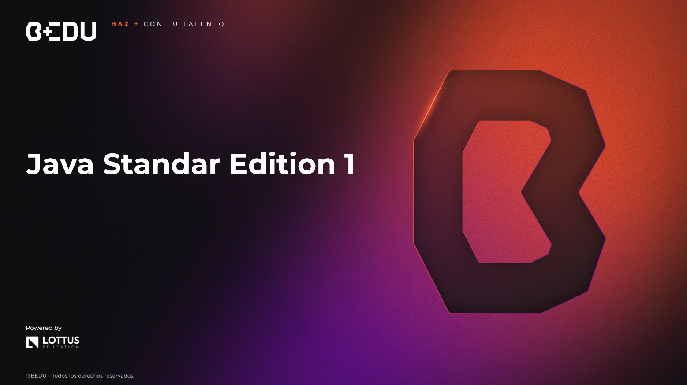

    

# 🚀 Curso de Java Standard Edition 1

## 🎯 Objetivo del Curso  
🟡 Aprender los fundamentos de Java aplicando programación orientada a objetos (POO), estructuras de datos, manejo de archivos con NIO.2 y buenas prácticas como SOLID y manejo de excepciones, para escribir código limpio y escalable.

## 📘 Prework

| #  | Sesión |
|----|--------|
| 01 | 🛠️ [Conceptos básicos de Java y configuración del entorno](Sesion-01/Prework/Readme.md) |
| 02 | ➕ [Tipos primitivos, operadores, estructuras de control](Sesion-02/Prework/Readme.md) |
| 03 | 🧠 [Principios básicos de POO](Sesion-03/Prework/Readme.md) |
| 04 | 🛡️ [Modificadores, encapsulamiento, código limpio](Sesion-04/Prework/Readme.md) |
| 05 | 🧱 [Jerarquías de clases, relaciones entre objetos](Sesion-05/Prework/Readme.md) |
| 06 | 📊 [Listas, mapas y estructuras básicas](Sesion-06/Prework/Readme.md) |
| 07 | 💾 [Introducción a I/O y NIO](Sesion-07/Prework/Readme.md) |
| 08 | ⚙️ [Excepciones, SOLID y clean code](Sesion-08/Prework/Readme.md) |
| 09 | 🧭 [Mentorship 1](Sesion-09/Prework/Readme.md) |
| 10 | 🔄 [Mentorship 2](Sesion-10/Prework/Readme.md) |

## 📚 Sesiones

| #  | Sesión |
|----|--------|
| 01 | 🏁 [Introducción a Java y POO](Sesion-01/Readme.md) |
| 02 | 🔀 [Tipos de datos y control de flujo](Sesion-02/Readme.md) |
| 03 | 🏗️ [Clases, objetos y métodos](Sesion-03/Readme.md) |
| 04 | 📦 [Elementos de una clase y buenas prácticas](Sesion-04/Readme.md) |
| 05 | 🧬 [Herencia, composición y polimorfismo](Sesion-05/Readme.md) |
| 06 | 📂 [Colecciones y estructuras de datos](Sesion-06/Readme.md) |
| 07 | 📁 [Manejo de archivos con NIO.2](Sesion-07/Readme.md) |
| 08 | ✅ [Buenas prácticas y manejo de errores en Java](Sesion-08/Readme.md) |
| 09 | 🔁 [Mentorship 1](Sesion-09/Readme.md) |
| 10 | 🎯 [Mentorship 2](Sesion-10/Readme.md) |

---

🏆 ¡Mucho éxito! Nos vemos en la siguiente sesión.

---
