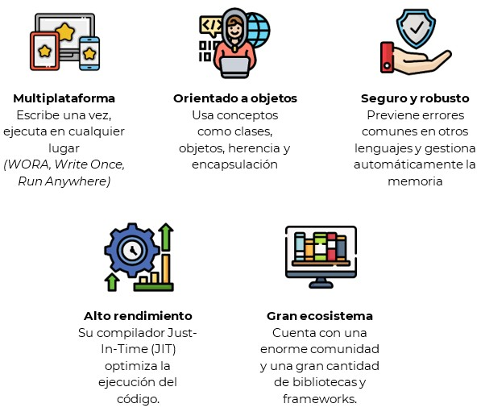

🏠 [**Inicio**](../../Readme.md) ➡️ / 📖 `Prework sesión 01`

    

##### **PREWORK**
#### **🟧 Sesión 01**
#### **Introducción a Java y Programación Orientada a Objetos (POO)**

##### 🔶 **Introducción**

¡Bienvenido/a al mundo de Java! 🚀

¡Hola! Te doy la bienvenida a esta primera sesión del curso Java Standard Edition, donde descubrirás los fundamentos de uno de los lenguajes de programación más utilizados en el mundo.

Java es el motor detrás de aplicaciones, sitios web, sistemas empresariales y mucho más. En este prework, explorarás sus bases, conocerás la Programación Orientada a Objetos (POO) y darás tus primeros pasos en la creación de clases y objetos. Así que, ¡manos a la obra! Prepárate para escribir tus primeras líneas de código y empezar este viaje en el universo de Java.

¿Estás listo/a? ¡Vamos a empezar! 🔥

---

#### 🎯 Objetivo

- Comprender los fundamentos de Java, su historia, características y aplicaciones en el desarrollo de software.

- Configurar el entorno de desarrollo e instalar las herramientas necesarias para escribir y ejecutar código en Java.

- Entender los principios de la Programación Orientada a Objetos (POO) y su importancia en la construcción de software modular y escalable.

- Crear y utilizar clases y objetos en Java, aplicando los conceptos básicos de encapsulamiento, atributos y métodos.

- Explorar nuevas características de Java, como record y sealed classes, para optimizar el diseño de clases y mejorar la seguridad del código.

---

#### 📋 Instrucciones

Este Prework está diseñado para conocer el contenido que se practicará durante la sesión en vivo. **Por favor no lo omitas.**

Toma notas de lo que consideres relevante y guarda tus preguntas o dudas para resolverlas en la sesión.

Antes de comenzar es importante que preparemos nuestro ambiente de trabajo. Para desarrollar en Java, necesitaremos dos herramientas clave: 

**🖥️ IntelliJ IDEA Community Edition**

Es un entorno de desarrollo integrado (IDE) diseñado para facilitar la programación en Java. Proporciona herramientas avanzadas para escribir, depurar y ejecutar código de manera eficiente. Su versión Community Edition es gratuita y ofrece características esenciales como autocompletado, navegación inteligente y depuración visual.

**✅ ¿Por qué instalarlo?**
- Facilita la escritura de código con sugerencias y autocompletado.
- Permite detectar errores antes de ejecutar el programa.
- Integra herramientas para pruebas y depuración.
- Es ampliamente utilizado en la industria y recomendado para desarrolladores Java.

💡 Antes de descargarlo, asegúrate de elegir el enlace correcto según tu sistema operativo:

🔹 Windows 👉 (https://www.jetbrains.com/es-es/idea/download/?section=windows)  
🔹 Mac 🍏 👉 (https://www.jetbrains.com/es-es/idea/download/?section=mac)  
🔹 Linux 🐧 👉 (https://www.jetbrains.com/es-es/idea/download/?section=linux)  

**📌 Recuerda**: La instalación puede variar un poco según el sistema operativo, pero no te preocupes, el asistente de instalación te guiará paso a paso.

**☕ JDK (Java Development Kit)**
Es el kit de desarrollo de Java que incluye el compilador, bibliotecas y herramientas necesarias para escribir y ejecutar programas en Java.

**✅¿Por qué instalarlo?**
- Permite compilar y ejecutar código Java en tu computadora.
- Incluye las herramientas necesarias para el desarrollo de aplicaciones.
- Es la base sobre la que funcionan todos los entornos de desarrollo de Java.

💡 Descarga la versión más reciente del JDK desde el siguiente enlace:
🔗 (https://www.oracle.com/mx/java/technologies/downloads/)

**¿Qué debes hacer?**
1. Accede al enlace y selecciona la versión más reciente del JDK.
2. Descarga el instalador adecuado según tu sistema operativo (Windows, macOS o Linux).
3. Sigue las instrucciones del asistente de instalación.

**📌 Nota:** Durante la instalación, asegúrate de que la variable de entorno JAVA\_HOME se configure correctamente. Esto te permitirá ejecutar comandos de Java desde cualquier terminal o consola.

¡Listo! Con esto ya estarás preparado para comenzar a programar en Java. 

---

**Bienvenido/a**

Bienvenid@ al primer Prework del módulo. A continuación, te presentamos el tiempo estimado de lectura por tema, para que puedas revisar todos los recursos al máximo: 

| **📖 Temario**                                                       | **🕰️ Tiempo sugerido** |
|----------------------------------------------------------------------|---------------------|
| Tema 01. Conceptos básicos de Java y primeros pasos                  | 10 min              |
| Tema 02. Fundamentos de la Programación Orientada a Objetos (POO)    | 15 min              |
| Tema 03. Creación de clases y objetos en Java                        | 5 min               |
| Tema 04. Introducción a 'record' y 'sealed classes'                  | 5 min               |

**¡Comencemos! 🏁**

---
 
#### 📚 Tema 01. Conceptos básicos de Java y primeros pasos
##### ⏳ 10 minutos de lectura

**☕ ¿Qué es Java?**

Java es un lenguaje de programación de alto nivel, orientado a objetos, multiplataforma y seguro. Fue desarrollado por Sun Microsystems en 1995 y actualmente es mantenido por Oracle Corporation. Su principal ventaja es su capacidad de ejecutarse en diferentes sistemas operativos sin modificaciones gracias a la Máquina Virtual de Java (JVM, Java Virtual Machine).

**Características principales de Java**

  

**✍️ Conceptos clave antes de programar en Java**  
Antes de escribir código en Java, es importante comprender algunos conceptos fundamentales del lenguaje.

**📌 Sintaxis básica de Java**  
Java tiene una estructura clara y ordenada. Aquí hay algunos elementos esenciales que debes conocer:

- *Clases y métodos*: Todo en Java está dentro de una `clase`, y cada programa comienza en un método llamado main.
- *Instrucciones y bloques de código*: En Java, cada instrucción termina con un ;, y los bloques de código se agrupan con `{ }`.
- *Comentarios*: Puedes agregar notas en tu código con `//` para comentarios de una línea o `/* */` para comentarios de varias líneas.

**🔹 Tipos de datos y variables**
En Java, usamos variables para almacenar información. Algunas de las más comunes son:

- *Números enteros*: `int` (ejemplo: `int edad = 25;`)
- *Números decimales*: `double` (ejemplo: `double precio = 99.99;`)
- *Texto*: `String` (ejemplo: `String nombre = "Juan";`)
- *Booleanos*: `boolean` (ejemplo: `boolean activo = true;`)

**🔹 Operadores en Java**
Los operadores nos permiten realizar cálculos y comparaciones. Algunos básicos incluyen:

- *Aritméticos*: `+`, `-`, `*`, `/`, `%`
- *Comparación*: `==`, `!=`, `>`, `<`, `>=`, `<=`
- *Lógicos*: `&&` (AND), `||` (OR), `!` (NOT)

**🔹 Control de flujo**
En Java, usamos estructuras de control para tomar decisiones y repetir acciones:

- *Condicionales*: `if`, `else` `if`, `else`
- *Bucles*: `for`, `while`, `do-while`

>**⚠️Pero no te preocupes**: a medida que avancemos en el curso, profundizaremos más en estos temas, aplicándolos de manera práctica para fortalecer tu comprensión 😉

Ahora que tienes una visión clara de lo que hace especial a Java, estás listo para dar el siguiente paso y sumergirte en la Programación Orientada a Objetos (POO).

---

#### 📚 Tema 02. Fundamentos de la Programación Orientada a Objetos (POO)
##### ⏳ 5 minutos de lectura

La Programación Orientada a Objetos (POO) es un paradigma de programación, es decir, un enfoque o modelo que define la manera en que organizamos y estructuramos el código en un lenguaje de programación. En lugar de centrarnos en funciones y procedimientos, en POO trabajamos con objetos, que representan entidades con características y comportamientos propios.
Este paradigma nos permite estructurar el código de manera modular y reutilizable, facilitando el desarrollo de software escalable y mantenible.

**¿Por qué usar POO?**  
Java es un lenguaje totalmente orientado a objetos, lo que significa *que toda la estructura del código gira en torno a este concepto*. Algunos beneficios clave de POO son:

- **Modularidad**: Divide el código en partes reutilizables y fáciles de mantener.
- **Encapsulamiento**: Protege los datos dentro de los objetos y controla su acceso.
- **Reutilización**: Permite usar código existente sin necesidad de reescribirlo.
- **Facilidad de mantenimiento**: El código es más organizado y fácil de actualizar.
- **Escalabilidad**: Ideal para aplicaciones grandes y en constante crecimiento.

Para comprender POO en Java, es fundamental conocer estos cuatro pilares:

1️⃣ **Encapsulamiento**

Consiste en ocultar los detalles internos de un objeto y permitir que solo se acceda a ellos a través de métodos específicos. Se logra usando modificadores de acceso como `private`, `public` y `protected`.

💡 **Ventaja**: Protege los datos y evita modificaciones no autorizadas.

2️⃣ **Herencia**

Es la capacidad de una clase de *heredar atributos y métodos* de otra clase. Esto permite reutilizar código y establecer jerarquías de clases.

Ejemplo:
- Clase Animal (general)
- Clase Perro y Gato (heredan de Animal y pueden tener comportamientos adicionales)

**💡 Ventaja**: Evita la duplicación de código y facilita la extensión de funcionalidades.

3️⃣ **Polimorfismo**

Significa que un mismo método puede comportarse de manera diferente según el contexto.

Ejemplo:
Si tenemos un método `hacerSonido()`, en la clase `Perro` puede imprimir `"Ladrido"` y en la clase `Gato` puede imprimir `"Maullido"`.

**💡 Ventaja**: Permite escribir código más flexible y adaptable.

4️⃣ **Abstracción**

Consiste en ocultar los detalles complejos de una implementación y mostrar solo la funcionalidad esencial.

Ejemplo: 
Si tenemos una clase `FiguraGeometrica` que define métodos como `calcularArea()`, sin necesidad de especificar cómo se calcula para cada figura (triángulo, cuadrado, círculo, etc.)

**💡 Ventaja**: Simplifica el diseño y permite trabajar con conceptos generales sin preocuparse por detalles internos.

**🔎 Resumen**
- Encapsulamiento protege los datos y restringe el acceso a la información interna. 
- Herencia permite reutilizar código y definir jerarquías entre clases. 
- Polimorfismo otorga flexibilidad a los métodos y comportamientos de los objetos. 
- Abstracción simplifica el diseño mostrando solo lo esencial y ocultando detalles de implementación.

---

#### 📚 Tema 03. Creación de clases y objetos en Java
##### ⏳ 5 minutos de lectura

En la Programación Orientada a Objetos (POO), las *clases y objetos* son los pilares fundamentales. Una clase es una plantilla que define las características y comportamientos de un objeto, mientras que un objeto es una instancia concreta de esa clase con valores específicos.

**¿Qué es una clase en Java?**  
Una *clase* en Java es una estructura que agrupa datos (atributos) y comportamientos (métodos).  

Ejemplo  
Imagina una clase *"Coche"*, que contiene atributos como *marca, modelo y año*, y métodos como *acelerar y frenar*.

Las clases permiten organizar el código de manera modular, facilitando su reutilización y mantenimiento.

Los beneficios de usar clases en Java:  
✅ Permiten modelar elementos del mundo real en software.  
✅ Agrupan datos y acciones en una sola entidad.  
✅ Facilitan la organización y escalabilidad del código.  

**Creación e instanciación de objetos**  

Un *objeto* es una instancia concreta de una clase. Al crear un objeto, le asignamos valores específicos a sus atributos y podemos llamar a sus métodos para ejecutar acciones.

Ejemplo  
Si la clase es *"Coche"*, entonces un objeto podría ser *"Toyota Corolla 2023"*, con sus atributos específicos y métodos disponibles.

Los objetos permiten crear múltiples instancias de una misma clase, cada una con sus propias características.

Proceso de creación de un objeto:  
1. Se define una clase con sus atributos y métodos.  
2. Se instancia un objeto a partir de esa clase.  
3. Se asignan valores a sus atributos y se ejecutan sus métodos.  

**Métodos y constructores**

Los *métodos* en Java son funciones dentro de una clase que definen el comportamiento de los objetos. Se utilizan para realizar acciones como calcular, modificar datos o imprimir información.

Un *constructor* es un tipo especial de método que se ejecuta automáticamente cuando se crea un objeto. Su propósito es inicializar los valores de los atributos del objeto.

📌 Diferencia entre métodos y constructores:
- Un *método* puede ejecutarse en cualquier momento para realizar una acción.
- Un *constructor* solo se ejecuta una vez, al momento de instanciar un objeto.

Beneficios de los constructores:  
✅ Facilitan la inicialización de objetos.  
✅ Aseguran que todos los atributos tengan valores definidos desde el inicio.  
✅ Evitan la necesidad de asignar valores manualmente después de crear el objeto.  

**Modificadores de acceso (`public`, `private`, `protected`)**

Los modificadores de acceso controlan la visibilidad y seguridad de los atributos y métodos dentro de una clase.

📌 Tipos de modificadores de acceso en Java:

| Modificador | Accesible desde la misma clase | Accesible desde otras clases del mismo paquete | Accesible desde clases externas (otro paquete) |
|-------------|--------------------------------|-------------------------------------------------|-----------------------------------------------|
| `public`    | ✅ Si                         | ✅ Si                                           | ✅ Si                                         |
| `private`   | ✅ Si                         | ❌ No                                           | ❌ No                                         |
| `protected` | ✅ Si                         | ✅ (si es subclase)                             | ✅ (si es subclase y en el mismo paquete)     |

Ejemplo
- Si un atributo es `private`, solo puede ser modificado dentro de la misma clase.
- Si un método es `public`, puede ser llamado desde cualquier otra clase.
- Si una variable es `protected`, solo puede ser accedida desde la misma clase o sus clases hijas (herencia).

¿Por qué usar modificadores de acceso?
- Protegen los datos sensibles de una clase.
- Evitan accesos no controlados desde otras partes del programa.
- Permiten encapsular la lógica y controlar qué información es accesible.

**🔎 Resumen**
- Las clases son plantillas que definen atributos y métodos. 
- Los objetos son instancias de una clase con valores específicos. 
- Los métodos permiten definir acciones dentro de una clase. 
- Los constructores facilitan la inicialización de objetos. 
- Los modificadores de acceso protegen y controlan el acceso a los atributos y métodos de una clase.

---

#### 📚 Tema 04. Introducción a `record` y `sealed classes`
##### ⏳ 5 minutos de lectura

Las versiones modernas de Java han incorporado nuevas formas de definir clases de manera más concisa y segura.

**¿Qué es un `record` en Java?**

Un `record` es un tipo especial de clase en Java diseñado para representar datos inmutables de una manera más sencilla y sin necesidad de escribir código repetitivo.

📌 Características principales de `record`:  
✅ Una vez creado, su estado no puede modificarse, por lo tanto, es inmutable  
✅ Java genera automáticamente métodos como `toString()`, `equals()`, y `hashCode()`.  
✅ No es necesario definir manualmente constructores, getters o setters, haciendo un código menos repetitivo.  

❓¿Cuándo usar `record`?
- Cuando necesites almacenar datos sin modificar su estado después de la creación.
- Para evitar escribir código repetitivo en clases simples.
- En casos donde la lógica principal de la clase es únicamente contener datos (ejemplo: coordenadas, configuraciones, entidades de solo lectura).

**¿Qué son las `sealed classes` en Java?**

Las `sealed classes` son una nueva forma de controlar la herencia en Java, permitiendo definir exactamente qué clases pueden extender una clase padre.

📌 Características principales de sealed classes:  
✅ Permite definir un conjunto específico de clases que pueden heredar de la clase padre.  
✅ Evita que cualquier otra clase pueda extender la clase sin restricciones, generando mayor seguridad  
✅ Facilita la lectura y mantenimiento de jerarquías de clases, asegurando que las subclases sean predecibles.  

❓¿Cuándo usar `sealed classes`?
- Cuando quieres *limitar* qué clases pueden extender una clase base.
- Para evitar que desarrolladores externos creen subclases inesperadas.
- Cuando tienes una *jerarquía de clases bien definida* y quieres garantizar su estructura.

**🔎 Resumen**
- record permite definir clases inmutables sin escribir código repetitivo. 
- Las sealed classes ayudan a restringir la herencia, mejorando la seguridad y el mantenimiento del código. 
- Estas características facilitan la escritura de código más limpio, seguro y eficiente en Java.

---

#### 🧠 Actividad de reforzamiento
Responde las siguientes preguntas y reflexiona sobre cada tema. Puedes escribir tus respuestas en un documento o compartirlas en el grupo de estudio.

**1. Reflexión sobre Java**  
- ¿Qué significa que Java sea un lenguaje multiplataforma?  
- ¿Por qué Java es considerado un lenguaje orientado a objetos?  
- Menciona tres características clave de Java y explica su importancia.  

**2. Identificación de Clases y Objetos**  
Piensa en objetos del mundo real y responde:  

- Identifica tres objetos de la vida cotidiana que puedan representarse en Java como una clase.  
- Para cada objeto, describe tres atributos (características) y dos métodos (acciones que puede realizar).  

**3. Exploración de Pilares de POO**  
Relaciona los cuatro pilares de la Programación Orientada a Objetos con ejemplos reales:  

- **Encapsulamiento**: ¿Cómo aplicarías este concepto en un programa que maneja información personal?  
- **Herencia:** Menciona un ejemplo en la vida real donde un objeto hereda características de otro.  
- **Polimorfismo:** Explica cómo un mismo método puede comportarse de manera diferente en distintos contextos.  
- **Abstracción:** ¿Cómo ayuda la abstracción a simplificar la programación en proyectos grandes?  

**4. Reflexión sobre record y sealed classes**  
- ¿Cuáles son las ventajas de utilizar record en lugar de una clase tradicional en Java?  
- ¿Cómo sealed classes mejora la seguridad y el control en la herencia de clases?  

---

#### **📝 Cierre**

Hemos explorado los fundamentos esenciales de Java y la Programación Orientada a Objetos (POO), sentando las bases para el desarrollo de aplicaciones en este lenguaje. Desde comprender qué es Java y sus características principales, hasta profundizar en la estructura de clases y objetos, pasando por conceptos clave como encapsulamiento, herencia, polimorfismo y abstracción. También hemos visto cómo las versiones modernas de Java han simplificado la programación con características como record y sealed classes, permitiendo escribir código más conciso, seguro y eficiente.

Con esta introducción, ya cuentas con una visión clara de lo que Java puede ofrecer y cómo su paradigma de programación facilita la construcción de software robusto y escalable. En las próximas sesiones, pondremos en práctica estos conceptos, llevándolos a código y aplicándolos en ejercicios reales.

¡Prepárate para la siguiente etapa! Recuerda repasar los temas clave, familiarizarte con la terminología y llegar con dudas o reflexiones para la sesión en vivo. ¡Nos vemos pronto para seguir avanzando en tu camino como desarrollador Java!

---

⬅️ [**Anterior**](../../Readme.md) | [**Siguiente**](../../Sesion-02/Prework/Readme.md)➡️