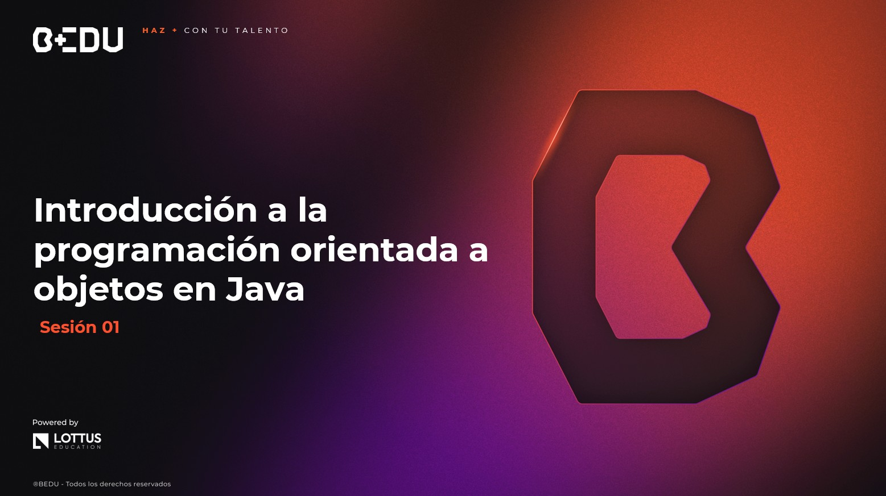

🏠 [**Inicio**](../Readme.md) ➡️ / 📖 `Sesión 01`

    

# 🎯 Objetivo

⚒️ Identificar y comprender los conceptos básicos de **Java**, incluyendo **Programación Orientada a Objetos (POO)**, para aplicarlos en la creación de programas sencillos.

---

## 📂 Temas de la sesión...

### 📖 Introducción a Java y primeros pasos  
Java es un lenguaje de programación **orientado a objetos** ampliamente utilizado en la industria. En esta sesión, exploraremos sus conceptos básicos y cómo escribir nuestro primer programa en Java.  

🔹 **Conceptos clave de Java**  
🔹 **Estructura básica de un programa en Java**  
🔹 **Compilación y ejecución de código en Java (Línea de comandos)**  

📜 **[Ejemplo 01: Mi primer programa en Java](Ejemplo-01/Readme.md)**  

---

### 📖 Fundamentos de la programación orientada a objetos (POO)  
La POO es un paradigma de programación basado en la creación y manipulación de **objetos**. Java implementa la POO con los siguientes principios clave:  

🔹 **Encapsulación**: Control del acceso a los datos dentro de las clases.  
🔹 **Herencia**: Creación de nuevas clases a partir de clases existentes.  
🔹 **Polimorfismo**: Capacidad de los métodos de comportarse de manera diferente según el objeto.  
🔹 **Abstracción**: Ocultamiento de detalles de implementación, enfocándose solo en lo esencial.  

📜 **[Ejemplo 02: Creando nuestra primera clase en java](Ejemplo-02/Readme.md)**  
🔥 **[Reto 01: Registro de pacientes](Reto-01/Readme.md)**  

---

### 📖 Clases y objetos en java  
Las **clases** son plantillas para la creación de **objetos**, que representan entidades en el mundo real con atributos y métodos.

🔹 **Definición y uso de clases en Java**  
🔹 **Creación e instanciación de objetos**  
🔹 **Métodos y constructores**  
🔹 **Modificadores de acceso (`public`, `private`, `protected`)**  

📜 **[Ejemplo 03: Definiendo una clase y creando objetos](Ejemplo-03/Readme.md)**  

---

### 📖 Introducción a `record` y `sealed classes` en java
En versiones modernas de Java, se han introducido nuevas formas de definir clases más concisas y seguras:

🔹 **`record`** → Para definir clases inmutables sin necesidad de escribir código repetitivo.  
🔹 **`sealed classes`** → Para restringir qué clases pueden heredar de una clase padre.  

📜 **[Ejemplo 04: Uso de record y sealed classes](Ejemplo-04/Readme.md)**  
🔥 **[Reto 02: Registro básico de entradas](Reto-02/Readme.md)**  

---

⬅️ [**Anterior**](../Readme.md) | [**Siguiente**](../Sesion-02/Readme.md)➡️