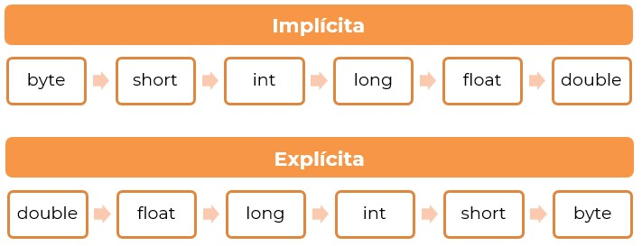
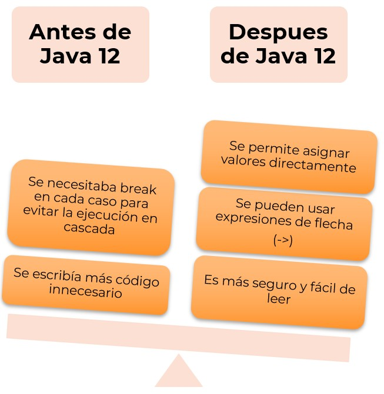

🏠 [**Inicio**](../../Readme.md) ➡️ / 📖 `Prework sesión 02`

<div align="center">
    
</div>

##### **PREWORK**
#### **🟧 Sesión 02**
#### **Tipos de datos y control de flujo**


##### 🔶 **Introducción**  

¡Hola!, ¡que genial verte aquí! En esta sesión, nos adentraremos en los tipos de datos y el control de flujo en Java. Estos conceptos los usaremos para que puedas escribir código más estructurado, eficiente y fácil de entender.

Imagina que Java es un juego de construcción: los tipos de datos son las piezas con las que trabajas, los operadores te ayudan a moldearlas y las estructuras de control te permiten decidir cómo se ensamblan para darle vida a tu programa.

Antes de nuestra sesión en vivo, este prework te dará las bases necesarias para que llegues preparado. Exploraremos los distintos tipos de datos, cómo funciona la inferencia con var, el poder de los operadores y la magia de los condicionales y bucles.

Así que... ¡manos al código! ⚡ Prepárate para escribir tus primeras estructuras de control y dar el siguiente paso en tu camino como desarrollador Java.

---

#### 🎯 Objetivo  

- Comprender y aplicar los distintos tipos de datos en Java, incluyendo la inferencia de tipos con var.
- Utilizar correctamente operadores y expresiones para realizar cálculos y manipulaciones de datos en Java.
- Implementar estructuras de control como condicionales (if, switch) para tomar decisiones en el flujo del programa.
- Manejar bucles de control (for, while, do-while, for-each) para la ejecución repetitiva y eficiente del código.

---

#### 📋 Instrucciones  

Este Prework está diseñado para conocer el contenido que se practicará durante la sesión en vivo. **Por favor no lo omitas.**

Toma notas de lo que consideres relevante y guarda tus preguntas o dudas para resolverlas en la sesión.

Antes de comenzar, es fundamental asegurarte de que tu entorno de trabajo esté listo. Verifica que tienes instalado IntelliJ IDEA Community Edition y el JDK (Java Development Kit).

Si encuentras algún problema o tienes dudas sobre la instalación, no dudes en contactar a tu experto/a para recibir asistencia y resolver cualquier inconveniente. ¡Estamos aquí para ayudarte! 🚀

---

**Bienvenido/a**  

Bienvenid@ al segundo Prework del módulo. A continuación, te presentamos el tiempo estimado de lectura por tema, para que puedas revisar todos los recursos al máximo: 

| **📖 Temario**                                                                  | **🕰️ Tiempo sugerido** |
|----------------------------------------------------------------------------------|---------------------|
| Tema 01. Tipos de datos en Java y uso de `var`                                   | 5 min              |
| Tema 02. Operadores y expresiones en Java                                        | 5 min              |
| Tema 03. Sentencias condicionales (`if`, `switch`)                               | 5 min              |
| Tema 04. Bucles y estructuras de control (`for`, `while`, `do-while`, `for-each`)| 5 min               |

**¡Comencemos! 🏁**

---
 
#### 📚 Tema 01. Tipos de datos en Java y uso de `var`
##### ⏳ 5 minutos de lectura  

En Java, los datos que usas en tus programas necesitan estar bien organizados y definidos. Para ello, Java ofrece diferentes tipos de datos, que te permiten almacenar información como números, textos o valores booleanos. Además, con la introducción de var, puedes escribir código de manera más flexible sin perder claridad.

A continuación, exploraremos las bases que te ayudarán a comprender y manejar los tipos de datos en Java de manera efectiva.

**Tipos primitivos y su uso**  
Los tipos primitivos son la base del manejo de datos en Java. Son valores simples, sin métodos ni funcionalidades adicionales, diseñados para ser eficientes en memoria.

| **Tipo**  | **Descripción**                          | **Tamaño** | **Rango de valores**                                                  |
|-----------|-------------------------------------------|------------|------------------------------------------------------------------------|
| `byte`    | Número entero pequeño                     | 8 bits     | -128 a 127                                                             |
| `short`   | Número entero mediano                     | 16 bits    | -32,768 a 32,767                                                       |
| `int`     | Número entero estándar                    | 32 bits    | -2,147,483,648 a 2,147,483,647                                         |
| `long`    | Número entero grande                      | 64 bits    | -9,223,372,036,854,775,808 a 9,223,372,036,854,775,807                |
| `float`   | Número decimal de precisión simple        | 32 bits    | Aproximadamente 7 dígitos decimales

**🔑 Dato clave**: Los tipos primitivos son más eficientes que los objetos porque ocupan menos memoria y no tienen métodos adicionales.

**Uso de la inferencia de tipos con `var`**  

En versiones anteriores de Java, debías declarar explícitamente el tipo de cada variable. Sin embargo, desde Java 10, puedes usar `var` para que el compilador *infiera automáticamente* el tipo según el valor asignado.

💡 ¿Por qué usar `var`?  
✅ Hace que el código sea más corto y legible.  
✅ Permite escribir de manera más flexible sin perder seguridad en los tipos.  
✅ Evita redundancias innecesarias.  

🛑 Puntos a considerar sobre `var`  
- Solo se puede usar dentro de métodos o bloques de código, no en variables globales.
- El tipo se asigna en el momento de la declaración y no cambia después.
- No se recomienda para valores poco claros, ya que podría reducir la legibilidad.

**🔑 Dato clave:** Aunque `var` ayuda a escribir código más limpio, debes usarlo con criterio para que tu programa siga siendo fácil de entender.

**Conversión de tipos y casting**  

A veces, necesitarás convertir un tipo de dato en otro. Esto se llama *conversión de tipos* o *casting*.

Existen dos tipos de conversión:

1️⃣ **Conversión implícita (Widening Casting)**:  
- Ocurre automáticamente cuando conviertes un tipo pequeño a uno más grande.  
- Ejemplo: `int → long` o `float → double`.  

2️⃣ **Conversión explícita (Narrowing Casting)**:  
Necesita ser especificada porque puede perder información.  
Ejemplo: `double → int` (pierde los decimales).  

**📊 Esquema de conversión de tipos**  

<div align="center">
  
</div>

💡 **Consejo**: Usa conversión explícita solo cuando sea necesario, ya que puede afectar la precisión de los datos.

**🔎 Resumen**  
- Los tipos primitivos son la base del almacenamiento de datos en Java.
- `var` te permite declarar variables sin especificar el tipo, siempre que el compilador pueda inferirlo.
- El casting te ayuda a convertir datos entre tipos compatibles, pero debes usarlo con cuidado para evitar pérdidas de información.

---

#### 📚 Tema 02. Operadores y expresiones en Java
##### ⏳ 5 minutos de lectura

Los operadores en Java son símbolos especiales que te permiten realizar operaciones sobre valores y variables. Son fundamentales para construir expresiones y definir la lógica de los programas.

**🔢 Operadores aritméticos**  
Se utilizan para realizar cálculos matemáticos con valores numéricos.

| **Operador** | **Descripción**        | **Ejemplo** | **Resultado**     |
|--------------|------------------------|-------------|-------------------|
| `+`          | Suma                   | `a + b`     | `13`              |
| `-`          | Resta                  | `a - b`     | `7`               |
| `*`          | Multiplicación         | `a * b`     | `30`              |
| `/`          | División               | `a / b`     | `3 (en enteros)`  |
| `%`          | Módulo (residuo)       | `a % b`     | `1`               |

**🔑 Dato clave**: En la división de enteros, Java *trunca* el resultado, es decir, descarta los decimales.

**🔍 Operadores relacionales**  
Estos operadores permiten comparar valores y devuelven un resultado *booleano* (`true` o `false`).

| **Operador** | **Descripción**       | **Ejemplo**  | **Resultado** |
|--------------|-----------------------|--------------|----------------|
| `==`         | Igual a               | `a == b`     | `false`        |
| `!=`         | Distinto de           | `a != b`     | `true`         |
| `>`          | Mayor que             | `a > b`      | `true`         |
| `<`          | Menor que             | `a < b`      | `false`        |
| `>=`         | Mayor o igual que     | `a >= b`     | `true`         |
| `<=`         | Menor o igual que     | `a <= b`     | `false`        |

**🔑 Dato clave**: La comparación `==` solo funciona bien con tipos primitivos. Para comparar objetos, se usa `.equals()`.

**🧠 Operadores lógicos**  
Los operadores lógicos se usan para combinar condiciones booleanas.

| **Operador** | **Descripción**     | **Ejemplo** | **Resultado** |
|--------------|---------------------|-------------|----------------|
| `&&`         | AND (y)             | `x && y`    | `false`        |
| `||`         | OR (o)              |             | `true`         |
| `!`          | NOT (negación)      | `!x`        | `false`        |
| `&`          | AND bit a bit       | `x & y`     | `false`        |
|              | OR bit a bit        |             | `false`        |

**🔑 Dato clave**: `&&` y `||` usan *evaluación cortocircuito*, lo que significa que, si el primer valor ya determina el resultado, el segundo no se evalúa.

**✍️ Operadores de asignación**  
Se usan para asignar valores a variables.

| **Operador** | **Descripción**       | **Ejemplo**   | **Equivalente a…** | **Resultado** |
|--------------|-----------------------|----------------|---------------------|----------------|
| `=`          | Asignación             | `x = 10`       | `x = 10`            | `x = 10`       |
| `+=`         | Suma y asigna          | `x += 3`       | `x = x + 3`         | `x = 8`        |
| `-=`         | Resta y asigna         | `x -= 2`       | `x = x - 2`         | `x = 3`        |
| `*=`         | Multiplica y asigna    | `x *= 4`       | `x = x * 4`         | `x = 20`       |
| `/=`         | Divide y asigna        | `x /= 2`       | `x = x / 2`         | `x = 2`        |
| `%=`         | Módulo y asigna        | `x %= 2`       | `x = x % 2`         | `x = 1`        |

**🔑 Dato clave**: Estos operadores reducen la cantidad de código y mejoran la legibilidad.

**🔄 Operadores de incremento y decremento**  
Se usan para aumentar o reducir en 1 el valor de una variable.

| **Operador** | **Descripción**     | **Ejemplo** | **Resultado**     |
|--------------|---------------------|-------------|-------------------|
| `++x`        | Pre-incremento      | `y = ++x`   | `x = 6, y = 6`    |
| `x++`        | Post-incremento     | `y = x++`   | `x = 6, y = 5`    |
| `--x`        | Pre-decremento      | `y = --x`   | `x = 4, y = 4`    |
| `x--`        | Post-decremento     | `y = x--`   | `x = 4, y = 5`    |

**🔑 Diferencia clave:**  
- En el *pre-incremento/decremento*, el cambio ocurre *antes* de usar la variable.
- En el *post-incremento/decremento*, la variable se usa *primero* y luego se modifica.

**⚖️ Precedencia de operadores en Java**  
Cuando una expresión tiene varios operadores, Java sigue reglas de precedencia para decidir qué operación realizar primero. Los operadores con mayor prioridad se ejecutan primero.

| **Prioridad** | **Operadores**                                 | **Asociatividad**               |
|---------------|-------------------------------------------------|---------------------------------|
| 1 (Mayor)     | `()` (paréntesis)                               | De izquierda a derecha          |
| 2             | `++`, `--` (incremento y decremento)            | De derecha a izquierda          |
| 3             | `*`, `/`, `%` (multiplicación, división, módulo)| De izquierda a derecha          |
| 4             | `+`, `-` (suma y resta)                         | De izquierda a derecha          |
| 5             | `<`, `<=`, `>`, `>=` (relacionales)             | De izquierda a derecha          |
| 6             | `==`, `!=` (igualdad y desigualdad)             | De izquierda a derecha          |
| 7             | `&&` (AND lógico)                               | De izquierda a derecha          |
| 8             | __ (OR lógico)                                | De izquierda a derecha          |
| 9 (Menor)     | `=`, `+=`, `-=`, `*=`, `/=`, `%=` (asignación)  | De derecha a izquierda          |

**💫 Reglas clave**:  
- Los *paréntesis* tienen la mayor prioridad y fuerzan la evaluación en un orden específico.
- La *multiplicación y división* se resuelven antes que la suma y la resta.
- La *asignación* (`=`) se evalúa de derecha a izquierda.

**🔎 Resumen**  
- Los operadores te permiten realizar cálculos, comparaciones y evaluar condiciones en Java.
- Los operadores aritméticos, relacionales y lógicos te ayudan a trabajar con datos y controlar el flujo del programa.
- Los operadores de asignación y de incremento/decremento facilitan la modificación de valores en variables.
- La precedencia y asociatividad determinan el orden en que se evalúan las expresiones.

---

#### 📚 Tema 03. Sentencias condicionales (`if`, `switch`)  
##### ⏳ 5 minutos de lectura  

Las estructuras condicionales en Java permiten que tu programa tome decisiones basadas en ciertas condiciones. En este apartado, aprenderás a usar `if` y `switch` para manejar distintos escenarios de manera eficiente.

**`If-else`**  

La estructura `if-else` se usa cuando un programa necesita evaluar una condición y ejecutar código según el resultado.  

¿Cómo funciona?  
1. Si la condición es *verdadera* (`true`), el código dentro del bloque if se ejecuta.  
2. Si la condición es *falsa* (`false`), el código dentro del bloque else se ejecuta (si existe).  

💻 Estructura de `if-else` 

```java
if (condición) {
   // Código que se ejecuta si la condición es verdadera
} else {
   // Código que se ejecuta si la condición es falsa
}
```

💡 Variaciones de `if-else`  
✔️ if simple: Ejecuta código si la condición es true.  
✔️ if-else: Ejecuta un bloque si la condición es true, otro si es false.  
✔️ if-else if-else: Permite evaluar múltiples condiciones.  

**📌 Consejo**: Usa `if-else` cuando tengas pocas condiciones o cuando las comparaciones sean dinámicas.  

**Expresiones `switch` mejoradas en Java 12+**  

La estructura `switch` es útil cuando tienes *múltiples condiciones* basadas en un mismo valor. En Java 12, se introdujeron mejoras que hacen a `switch` más eficiente y legible.  

<div align="center">
  
</div>

📊 Comparación de `switch` tradicional vs. `switch` mejorado  

| **Característica**                    | **switch tradicional** | **switch mejorado** |
|--------------------------------------|-------------------------|----------------------|
| Requiere `break`                     | ✅ Sí                  | ❌ No               |
| Soporta asignaciones directas        | ❌ No                  | ✅ Sí               |
| Usa `->` para mayor claridad         | ❌ No                  | ✅ Sí               |
| Código más compacto                  | ❌ No                  | ✅ Sí               |

📌 ¿Cuándo usar `switch`?  
- Cuando tienes muchos casos a evaluar sobre un mismo valor.
- Cuando los casos son mutuamente excluyentes.

**Buenas prácticas**  

Para escribir código limpio y eficiente con estructuras condicionales, sigue estas buenas prácticas:

**✅ Usa if-else solo cuando sea necesario**  
- Si solo hay dos casos posibles, `if-else` es una buena opción.  
- Si hay muchas condiciones sobre una misma variable, considera `switch`.  

**✅ Evita la anidación excesiva**  
- No hagas código difícil de leer con demasiados `if` dentro de `if`.  
- Usa `return` o `break` temprano para simplificar.  

**✅ Prefiere `switch` mejorado en versiones recientes de Java**  
- Hace el código más claro y evita errores con break.  
- Usa `->` para mejorar la legibilidad.  

**💫 Regla de oro**: Escribe código fácil de entender, no solo funcional.  

**🔎 Resumen**  
- `if-else` se usa para evaluar condiciones y ejecutar código en función del resultado.  
- `switch` mejorado en Java 12+ permite código más limpio y seguro para múltiples casos.  

#### 📚 Tema 04. Bucles y estructuras de control (`for`, `while`, `do-while`, `for-each`).  
##### ⏳ 5 minutos de lectura  

Los bucles permiten repetir una acción varias veces sin escribir el mismo código repetidamente. Son fundamentales en la programación, ya que optimizan el código y facilitan la ejecución de tareas repetitivas.  

**Uso de `for`, `while`, `do-while`, `for-each`**  

¿Qué son los bucles?  
Un bucle es una estructura que ejecuta un bloque de código *mientras se cumpla una condición.*

**🔄 Bucle `for`**  
Ideal para cuando sabes *cuántas veces* debe repetirse el código.

💻 Estructura  

```java
for (inicialización; condición; actualización) {
   // Código a ejecutar
}
```
 Ejemplo  

```java
for (int i = 0; i < 5; i++) {
   System.out.println("Iteración: " + i);
}
```

**🔄 Bucle `while`**  
Ideal para cuando la cantidad de iteraciones *depende de una condición*.

💻 Estructura  

```java
while (condición) {
   // Código a ejecutar
}
```
 Ejemplo  

```java
int i = 0; 
while (i < 5) {
   System.out.println("Valor de i: " + i);
   i++;
}
```

**🔄 Bucle `do-while`**  
Ideal para cuando necesitas ejecutar al menos *una vez* el código, sin importar la condición.

💻 Estructura  

```java
do { 
   // Código a ejecutar
} while (condición);
```
 Ejemplo  

```java
int i = 0; 
do { 
   System.out.println("Ejecutando, i = " + i);
   i++;
} while (i < 5);
```
**🔑 Diferencia clave**: `do-while` *siempre* ejecuta el código al menos una vez.  

**🔄 Bucle `for-each`**  
Ideal para recorrer colecciones de datos como *arrays o listas* sin necesidad de un contador.

💻 Estructura  

```java
for (tipo variable : colección) {
   // Código a ejecutar
}
```
 Ejemplo  

```java
String[ ] nombres = {"Ana", "Luis", "Carlos"};
for (String nombre : nombres) {
   System.out.println("Nombre: " + nombre);
}
```

**💡Ventaja**: `for-each` *reduce errores* al evitar manipular índices manualmente.  

**Diferencias entre las estructuras de control**  

| **Bucle**     | **¿Cuándo usarlo?**                                       | **¿Se ejecuta al menos una vez?** | **¿Se usa con colecciones?** |
|---------------|------------------------------------------------------------|------------------------------------|-------------------------------|
| `for`         | Cuando el número de iteraciones es conocido               | ❌ No                              | ❌ No                         |
| `while`       | Cuando la repetición depende de una condición             | ❌ No                              | ❌ No                         |
| `do-while`    | Cuando necesitas ejecutar al menos una vez                | ✅ Sí                              | ❌ No                         |
| `for-each`    | Cuando recorres un array o colección                      | ❌ No                              | ✅ Sí                         |

**💫 Regla de oro**: Usa el bucle más adecuado según el caso para evitar código innecesario.  

**Buenas prácticas**  

**✅ Usa la estructura correcta:**  
- Si sabes cuántas veces repetir → `for`.
- Si es hasta que se cumpla algo → `while`.
- Si necesitas ejecutar al menos una vez → `do-while`.
- Si recorres colecciones → `for-each`.

**❌ Evita bucles infinitos**  
- Asegúrate de que la condición *cambie en cada iteración*.
- Evita `while (true)` sin una forma de salir.

**✅ Usa `break` y `continue` con moderación**  
- `break` detiene el bucle inmediatamente.
- `continue` salta a la siguiente iteración.
- 🚨 No abuses de ellos, pueden hacer que el código sea difícil de leer.

**✅ Optimiza el rendimiento**  
- Evita recorrer listas enteras si puedes detenerte antes.
- Usa estructuras de datos eficientes.

**🔎 Resumen**  
- Los bucles permiten ejecutar código repetitivo de manera eficiente.
- Cada bucle (`for`, `while`, `do-while`, `for-each`) tiene un uso específico.
- Las buenas prácticas ayudan a evitar errores comunes y mejorar el rendimiento.

---

#### 🧠 Actividad de reforzamiento  

**Relación de conceptos**  

Instrucciones: Completa la tabla con la descripción de cada concepto basado en lo aprendido. 

Si necesitas repasar algún tema, vuelve a la sección correspondiente del prework.

| **Tema**                               | **Concepto clave**                          | **Descripción / Ejemplo**     |
|----------------------------------------|---------------------------------------------|-------------------------------|
| Tipos de datos en Java y uso de `var`  | Tipos primitivos                             |                               |
|                                        | Uso de `var`                                 |                               |
|                                        | Conversión de tipos                          |                               |
| Operadores y expresiones en Java       | Operadores aritméticos                       |                               |
|                                        | Operadores relacionales                      |                               |
|                                        | Operadores lógicos                           |                               |
|                                        | Operadores de asignación                     |                               |
|                                        | Operadores de incremento/decremento          |                               |
|                                        | Precedencia de operadores                    |                               |
| 2.3 Sentencias condicionales (`if`, `switch`) | Estructura de `if-else`                  |                               |
|                                        | Expresiones `switch` mejoradas               |                               |
|                                        | Buenas prácticas                              |                               |
| 2.4 Bucles y estructuras de control    | Uso de `for`                                 |                               |
|                                        | Uso de `while`                               |                               |
|                                        | Uso de `do-while`                            |                               |
|                                        | Uso de `for-each`                            |                               |
|                                        | Diferencias entre estructuras de control     |                               |
|                                        | Buenas prácticas en bucles                   |                               |


---

#### 📝 Cierre  

🎯 ¡Has completado el prework de la sesión 02! 🎉  

¡Felicidades! 🎊 Ahora tienes una base sólida sobre tipos de datos, operadores, estructuras condicionales y bucles en Java. Con estos conocimientos, estarás listo para enfrentar desafíos más complejos en la programación y escribir código más estructurado y eficiente.  

🚀 ¿Qué sigue?  
- Refuerza lo aprendido: revisa los conceptos clave y asegúrate de entender sus aplicaciones.
- Ponlo en práctica: intenta escribir pequeños programas que usen los operadores, condicionales y bucles.
- Prepara tus dudas: si algo no quedó claro, anótalo para la sesión en vivo con el experto/a.

**💡 Recuerda**: La práctica constante y la curiosidad son las claves para mejorar en programación. ¡Nos vemos en la sesión en vivo para seguir aprendiendo juntos! 

---

⬅️ [**Anterior**](../../Sesion-01/Prework/Readme.md) | [**Siguiente**](../../Sesion-03/Prework/Readme.md)➡️