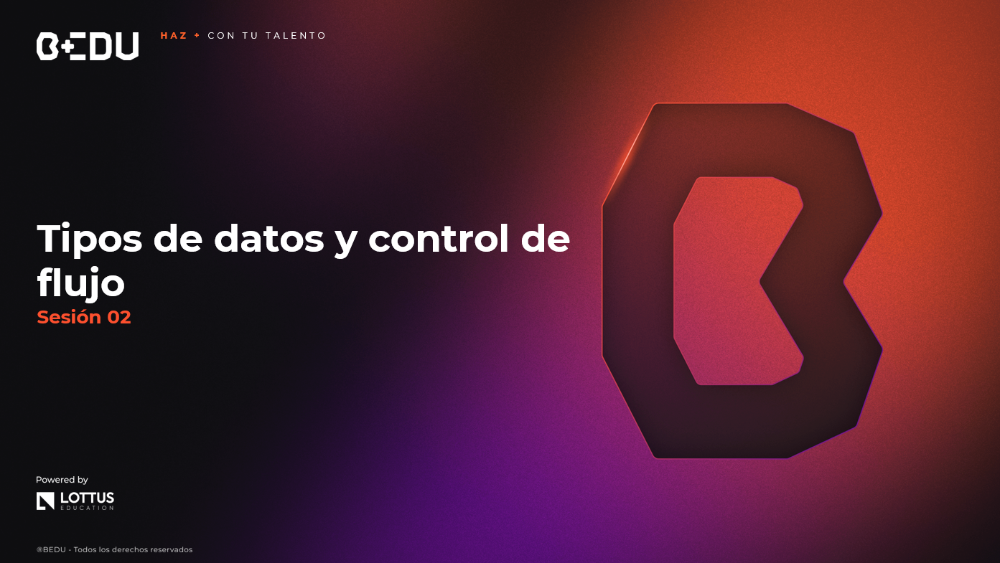

🏠 [**Inicio**](../Readme.md) ➡️ / 📖 `Sesión 02`

    

# 🎯 Objetivo

⚒️ Identificar y comprender los tipos de datos, variables, operadores, estructuras condicionales y ciclos en **Java**, para desarrollar programas con lógica básica mantenible y estructurada.

---

## 📂 Temas de la sesión...

### 📖 Tipos de datos en Java y uso de `var`
En Java, cada variable debe tener un tipo definido. En versiones modernas, también podemos usar `var` para inferencia de tipo.

🔹 **Tipos primitivos (`int`, `double`, `boolean`, etc.)**  
🔹 **Inferencia de tipo con `var`**  
🔹 **Conversión de tipos de datos y casting**

📜 **[Ejemplo 01: Declaración de variables y uso de `var`](Ejemplo-01/Readme.md)**  

---

### 📖 Operadores y expresiones en Java
Los operadores permiten realizar cálculos y tomar decisiones dentro de nuestros programas.

🔹 **Operadores aritméticos (`+`, `-`, `*`, `/`, `%`)**  
🔹 **Operadores relacionales (`==`, `!=`, `>`, `<`, etc.)**  
🔹 **Operadores lógicos (`&&`, `||`, `!`)**  
🔹 **Operadores de asignación (`=`, `+=`, `-=`, etc.)**  
🔹 **Operadores de incremento y decremento (++, --)**  
🔹 **Precedencia de operadores regla (pemdas)**  

📜 **[Ejemplo 02: Operaciones y comparaciones](Ejemplo-02/Readme.md)**  
🔥 **[Reto 01: Simulador de farmacia con descuento](Reto-01/Readme.md)**  

---

### 📖 Sentencias condicionales
Las estructuras condicionales permiten ejecutar distintas acciones dependiendo de una condición.

🔹 **Uso de `if`, `else if`, `else`**  
🔹 **`switch` tradicional y mejorado**  
🔹 **Buenas prácticas en condiciones anidadas**

📜 **[Ejemplo 03: Sentencias condicionales](Ejemplo-03/Readme.md)**  

---

### 📖 Ciclos y estructuras de control
Los ciclos permiten ejecutar bloques de código repetidamente, de manera controlada.

🔹 **`while`, `do-while`, `for`, `for-each`**  
🔹 **Control de flujo con `break` y `continue`**  
🔹 **Buenas practicas**

📜 **[Ejemplo 04: Repetición con ciclos](Ejemplo-04/Readme.md)**  
🔥 **[Reto 02: Cajero automático simple](Reto-02/Readme.md)**  

---

⬅️ [**Anterior**](../Sesion-01/Readme.md) | [**Siguiente**](../Sesion-03/Readme.md)➡️