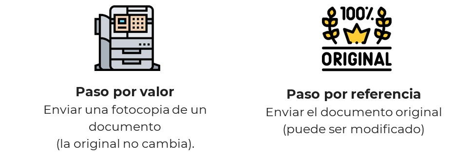
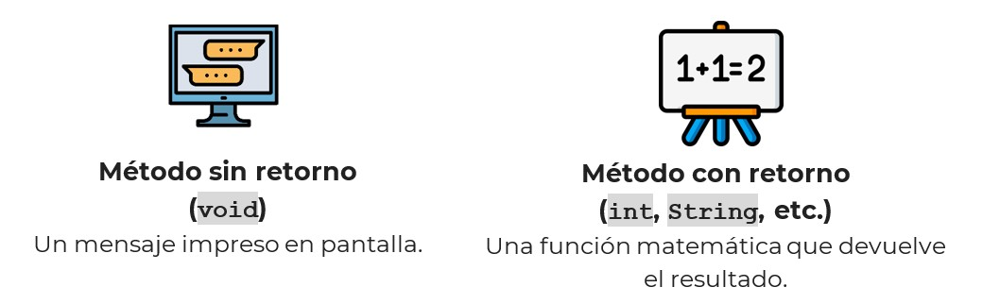
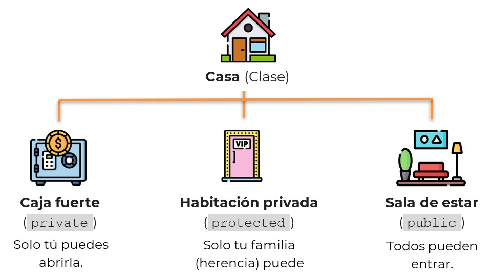

🏠 [**Inicio**](../../Readme.md) ➡️ / 📖 `Prework sesión 03`

<div align="center">
    
</div>

##### **PREWORK**
#### **🟧 Sesión 03**
#### **Clases, Objetos y Métodos**


##### 🔶 **Introducción**  

¡Hola! En esta sesión darás un gran paso en tu camino como desarrollador en Java. Vamos a sumergirnos en el corazón de la programación orientada a objetos: **clases, objetos y métodos**.

Imagina que estás construyendo un mundo digital donde cada elemento tiene propiedades y acciones. Aprenderás a dar vida a tus programas creando clases, instanciando objetos y definiendo métodos para que interactúen entre sí. También descubrirás cómo los modificadores de acceso te ayudan a organizar y proteger tu código, y cómo Optional puede hacer tu vida más fácil al manejar valores nulos sin errores inesperados.  

Este prework está diseñado para que llegues preparado a la sesión en vivo. Tómate tu tiempo para explorar cada concepto, experimenta con el código y, sobre todo, ¡disfruta del proceso! 💡💻  

---

#### 🎯 Objetivo  

- Comprender la creación y uso de clases y objetos en Java.  
- Implementar métodos con parámetros y valores de retorno para estructurar el código de manera eficiente.  
- Aplicar modificadores de acceso (private, protected, public) para controlar la visibilidad y seguridad del código.  
- Explorar el uso de Optional para el manejo seguro de valores nulos y evitar errores comunes.  

---

#### 📋 Instrucciones  

Este Prework está diseñado para conocer el contenido que se practicará durante la sesión en vivo. **Por favor no lo omitas.**

Toma notas de lo que consideres relevante y guarda tus preguntas o dudas para resolverlas en la sesión.

Antes de empezar, asegúrate de que tu entorno de desarrollo está listo. Verifica que tienes instalado IntelliJ IDEA Community Edition y el JDK (Java Development Kit) para trabajar sin contratiempos.

Si tienes algún problema con la instalación o te surge alguna duda, no dudes en contactar a tu experto/a. Estamos aquí para ayudarte a resolver cualquier inconveniente. 

---

**Bienvenido/a**  

Bienvenid@ al tercer Prework del módulo. A continuación, te presentamos el tiempo estimado de lectura por tema, para que puedas revisar todos los recursos al máximo: 

| **📖 Temario**                                                              | **🕰️ Tiempo sugerido** |
|-----------------------------------------------------------------------------|----------------------|
| Tema 01. Creación y uso de clases y objetos                                 | 5 min                |
| Tema 02. Métodos, parámetros y retorno de valores                           | 5 min                |
| Tema 03. Modificadores de acceso (`private`, `protected`, `public`)         | 5 min                |
| Tema 04. Introducción a `Optional` para manejo seguro de valores nulos.     | 5 min                |

**¡Comencemos! 🏁**  

---
 
#### 📚 Tema 01. Creación y uso de clases y objetos  
##### ⏳ 5 minutos de lectura  

Como ya hemos aprendido, Java es un lenguaje basado en la programación orientada a objetos (POO). Esto significa que todo gira en torno a clases y objetos, los cuales representan elementos del mundo real dentro de un programa.

Piensa en una clase como el molde o plano para construir algo y en los objetos como las instancias (copias reales) creadas a partir de ese molde.

**Estructura básica de una clase**

Visualiza una clase como un plano de construcción  

🟢 Atributos → Características del objeto (ejemplo: color, tamaño, nombre).  
🔵 Métodos → Acciones que puede realizar el objeto (ejemplo: encender, apagar, correr).  

Ejemplo  

| **Elemento** | **Ejemplo en la vida real**         |
|--------------|-------------------------------------|
| Clase        | Automóvil 🚗                       |
| Atributos    | Marca, modelo, color, año           |
| Métodos      | Arrancar, frenar, acelerar          |

💻 Estructura de una clase  

```java
// Definición de una clase llamada Car
public class Car {
    
    // Atributos de la clase (propiedades del objeto)
    private String brand;  // Marca del automóvil
    private String model;  // Modelo del automóvil
    private String color;  // Color del automóvil
    private int year;      // Año de fabricación

    // Constructor para inicializar los atributos
    public Car(String brand, String model, String color, int year) {
        this.brand = brand;
        this.model = model;
        this.color = color;
        this.year = year;
    }

    // Método para mostrar la información del automóvil
    public void displayCarInfo() {
        System.out.println("Marca: " + brand);
        System.out.println("Modelo: " + model);
        System.out.println("Color: " + color);
        System.out.println("Año: " + year);
    }
}
```

Este código muestra la estructura básica de una clase en Java:  
✅ Atributos (variables que representan características)  
✅ Constructor (método especial para inicializar la clase)  
✅ Métodos (acciones que la clase puede realizar)  

**Creación y uso de objetos (`static` y `final`)**  

Una *clase por sí sola no hace nada*, necesita crear *objetos* para cobrar vida.  

🛠️ ¿Qué es un objeto?  
Es una instancia de una clase. Es decir, cuando creamos un objeto, estamos generando una copia del molde (clase) y dándole valores concretos.  

📌 Diferencias clave:  

| **Concepto** | **Descripción**                                                                 |
|--------------|----------------------------------------------------------------------------------|
| `static`     | Se usa para definir atributos y métodos que pertenecen a la clase, no a una instancia específica. |
| `final`      | Indica que un valor, una variable o un objeto no puede cambiarse después de su asignación.       |

Ejemplo  

💡 Imagina una fábrica de autos:  
1. La fábrica (clase) tiene un modelo de coche predefinido.  
2. Cada coche fabricado (objeto) tiene un color y características propias.  
3. Algunas partes del coche nunca cambian, como el número de serie (`final`).  
4. El número total de coches producidos pertenece a la fábrica, no a un coche en particular (`static`).  

**🔎 Resumen**  

- Las clases son el plano, y los objetos son las instancias reales que creamos a partir de ellas.  
- `static` y `final` nos ayudan a definir valores que pertenecen a la clase o que no pueden cambiar.  

---

#### 📚 Tema 02. Métodos, parámetros y retorno de valores  
##### ⏳ 5 minutos de lectura  

Los métodos son el corazón de cualquier programa en Java. Son bloques de código que realizan una tarea específica y ayudan a estructurar mejor el código, promoviendo la reutilización y la organización.  

💡 Piensa en un método como una receta de cocina:  
- 📦 Ingredientes (parámetros) → Datos que se necesitan para ejecutar la receta.  
- 🍳 Preparación (cuerpo del método) → Pasos que se siguen para obtener un resultado.  
- 🍽️ Plato final (valor de retorno) → El resultado del método, si es necesario.  

**Definición y uso de métodos**  

❓¿Qué es un método?  
Un *método* es un conjunto de instrucciones que se ejecutan cuando se llama desde otra parte del programa.  

💻 Estructura de un método

```java
public class EjemploMetodo {
    
    // Método con parámetros y retorno de valor
    public int sumar(int a, int b) {
        return a + b;
    }

    public static void main(String[] args) {
        EjemploMetodo ejemplo = new EjemploMetodo();
        
        // Llamada al método
        int resultado = ejemplo.sumar(5, 3);
        
        // Imprimir resultado
        System.out.println("El resultado de la suma es: " + resultado);

    }

}
```

Este ejemplo sigue la estructura:  
- Modificador de acceso (`public`, `private`, etc.)   
- Tipo de retorno (`int`, `string`, `void`, etc.) 
- Nombre del método 
- Parámetros opcionales dentro de paréntesis 
- Cuerpo del método entre llaves

📌Tipos de métodos  

| **Tipo de método**           | **Descripción**                                                |
|-----------------------------|-----------------------------------------------------------------|
| Método sin retorno (`void`) | Realiza una acción, pero no devuelve ningún valor.              |
| Método con retorno          | Devuelve un valor específico.                                  |

Ejemplo

<div align="center">
  
</div>

**Paso de parámetros por valor y por referencia**  

❓¿Qué son los parámetros?  
Son valores que se envían a un método para que los use en su ejecución.  

📌 Tipos de paso de parámetros en Java  

| **Tipo de paso**  | **Descripción**                                                                 | **Aplicación en Java**                                      |
|-------------------|----------------------------------------------------------------------------------|--------------------------------------------------------------|
| Por valor         | Se pasa una copia del valor original, el dato original no se modifica.          | Se usa con tipos de datos primitivos (`int`, `double`, `char`, etc.). |
| Por referencia    | Se pasa la referencia a la memoria del objeto, permitiendo modificarlo dentro del método. | Se usa con objetos y arreglos.                              |

Ejemplo

<div align="center">
  
</div>

**Retorno de valores y sobrecarga de métodos**    

❓ ¿Qué es el retorno de valores?  
Un método puede devolver un valor después de ejecutar su lógica, lo que permite utilizarlo en otras partes del código.  

Ejemplo

<div align="center">
  
</div>

❓¿Qué es la sobrecarga de métodos?  
Es cuando un mismo método puede tener diferentes versiones con distintos parámetros.  

Ejemplo  

💡 Imagina que tienes un servicio de mensajería  
1. Método `enviarMensaje(String texto)` → Envía un mensaje de texto.  
2. Método `enviarMensaje(String texto, String imagen)` → Envía un mensaje con una imagen adjunta.  

📝 Resumen de sobrecarga de métodos:  
- Mismo nombre de método.  
- Diferentes parámetros (cantidad o tipo).  
- Permite más flexibilidad en la programación.  

**🔎 Resumen**  

Los métodos ayudan a organizar el código y mejorar su reutilización.  
- Los parámetros pueden pasarse por valor o por referencia, afectando si los datos originales se modifican.  
- Los métodos pueden devolver valores, y la sobrecarga permite tener múltiples versiones de un mismo método. 

---

#### 📚 Tema 03. Modificadores de acceso (`private`, `protected`, `public`)  
##### ⏳ 5 minutos de lectura  

En Java, los modificadores de acceso controlan quién puede acceder a los atributos y métodos de una clase. Esto ayuda a proteger los datos y a mantener una estructura organizada en el código.  

💡 Piensa en los modificadores de acceso como los niveles de seguridad de una casa:  
🔒 `private` → Solo tú puedes entrar (información completamente protegida).  
🔑 `protected` → Solo familiares pueden entrar (accesible en la misma familia/herencia).  
🚪 `public` → Cualquier persona puede entrar (visible desde cualquier parte del programa).  

**Niveles de acceso en Java**  

📌 Tipos de modificadores de acceso  

| **Modificador** | **Acceso desde la misma clase** | **Acceso desde clases del mismo paquete** | **Acceso desde clases heredadas** | **Acceso desde otras clases** |
|----------------|----------------------------------|-------------------------------------------|-----------------------------------|-------------------------------|
| `private`      | ✅ Sí                            | ❌ No                                     | ❌ No                             | ❌ No                         |
| `protected`    | ✅ Sí                            | ✅ Sí                                     | ✅ Sí                             | ❌ No                         |
| `public`       | ✅ Sí                            | ✅ Sí                                     | ✅ Sí                             | ✅ Sí                         |


Ejemplo

<div align="center">
  
</div>

**Encapsulación y protección de datos**  

La *encapsulación* es una técnica que permite *ocultar los datos* de una clase y controlar su acceso mediante métodos.  

Ejemplo  

💡 Un cajero automático  
- No puedes acceder directamente al dinero (`private`).
- Solo puedes obtener información si usas la tarjeta y sigues el proceso correcto (métodos públicos como `getSaldo()`).  

Beneficios de la encapsulación:  
- Protección de datos sensibles.
- Evita modificaciones accidentales de variables.
- Facilita el mantenimiento y la escalabilidad del código.

**🔎 Resumen**  
- Los modificadores de acceso (`private`, `protected`, `public`) controlan qué partes del código pueden acceder a los atributos y métodos de una clase. 
- La encapsulación protege los datos y evita que se modifiquen de forma incorrecta.  

---

#### 📚 Tema 04. Introducción a `Optional` para manejo seguro de valores nulos.  
##### ⏳ 5 minutos de lectura  

En Java, un error común ocurre cuando se intenta acceder a un objeto que *no ha sido inicializado*, lo que provoca una *NullPointerException*. Para evitar este problema, Java introduce `Optional`, una clase que ayuda a manejar valores nulos de manera segura.  

💡 Piensa en `Optional` como una caja que puede estar vacía o contener un valor.  
- 📦 Caja vacía → No hay valor presente (nulo).  
- 📦 Caja con contenido → Hay un valor disponible.  

❓¿Qué es `Optional` y por qué se usa? 

Supongamos que intentas acceder a un objeto que no ha sido inicializado:

```java
String nombre = null;
System.out.println(nombre.length()); // ❌ Esto genera un NullPointerException
```

❌ Problema: El programa se rompe porque `nombre` es `null`.  

📌 Solución: Usar `Optional`  
En lugar de trabajar directamente con valores que pueden ser nulos, podemos usar `Optional` para evitar estos errores y manejar mejor la ausencia de datos.  

Beneficios de `Optional`  
- Evita `NullPointerException`
- Hace el código más limpio y seguro
- Explicita que un valor puede estar ausente

📌 Métodos útiles de `Optional`

| **Método**                         | **Descripción**                                                             |
|-----------------------------------|------------------------------------------------------------------------------|
| `isPresent()`                     | Verifica si el `Optional` tiene valor.                                        |
| `ifPresent(Consumer<T>)`          | Ejecuta código si el valor está presente.                                   |
| `orElse(valorPorDefecto)`         | Devuelve el valor si está presente, o un valor por defecto si está vacío.   |
| `orElseGet(Supplier<T>)`          | Similar a `orElse()`, pero usa un proveedor de valores.                     |
| `orElseThrow(Supplier<Exception>)`| Lanza una excepción si el `Optional` está vacío.                              |

**Buenas prácticas en el uso de `Optional`**

- Usar `Optional` en retornos de métodos en lugar de devolver null.
- Utilizar `orElseGet()` en lugar de `orElse()` cuando el valor por defecto es costoso de calcular.
- Evitar isPresent() + get(), en su lugar usar `ifPresent()`.
- No usar `Optional` en atributos de clase, solo en retornos de métodos.

---

#### 🧠 Actividad de reforzamiento  
Responde las siguientes preguntas y reflexiona sobre cada tema.   

***Pregunta 1: ¿Cuál de las siguientes opciones describe mejor la relación entre una clase y un objeto en Java?***  
A) Una clase es una instancia de un objeto.  
B) Un objeto es una instancia de una clase.  
C) Un objeto y una clase son lo mismo.  

***Pregunta 2: ¿Cuál es la función principal de los modificadores de acceso (`private`, `protected`, `public`) en Java?***  
A) Controlar el acceso a los atributos y métodos dentro de una clase.  
B) Mejorar el rendimiento del código.  
C) Convertir variables en constantes.  

***Pregunta 3: ¿Cuál es el beneficio de usar `Optiona`l en Java?***  
A) Evita la necesidad de usar clases en Java.  
B) Permite manejar valores nulos de manera segura y evitar `NullPointerException`.  
C) Hace que el código sea más lento y difícil de leer.  

***Pregunta 4: ¿Cuál de las siguientes afirmaciones sobre métodos en Java es correcta?***  
A) Un método `void` devuelve siempre un valor numérico.  
B) Un método puede devolver un valor o no, dependiendo de su tipo de retorno.  
C) Los métodos en Java solo pueden tener un parámetro de entrada.  

***Pregunta 5: ¿Cómo se accede a un atributo `private` en una clase desde otra clase en Java?***  
A) Directamente usando `nombreDelObjeto.atributo`.  
B) No se puede acceder a un atributo `private` desde otra clase.  
C) A través de métodos `getter` y `setter`.  

---

#### **📝 Cierre**  

¡Felicidades por completar esta sesión! 🎉 Ahora tienes una base sólida en la programación orientada a objetos en Java, comprendiendo la importancia de las clases y objetos, la estructura y uso de los métodos, así como el control de acceso a través de los modificadores `private`, `protected` y `public`.  

También exploraste la encapsulación para proteger datos y mejorar la organización del código, y aprendiste cómo `Optional` te ayuda a manejar valores nulos de manera segura, evitando errores inesperados.  

La mejor manera de reforzar estos conocimientos es aplicándolos en proyectos y resolviendo ejercicios prácticos. Sigue explorando, experimentando y poniendo en práctica lo aprendido. ¡Nos vemos en la siguiente sesión!   

⬅️ [**Anterior**](../../Sesion-02/Prework/Readme.md) | [**Siguiente**](../../Sesion-04/Prework/Readme.md)➡️