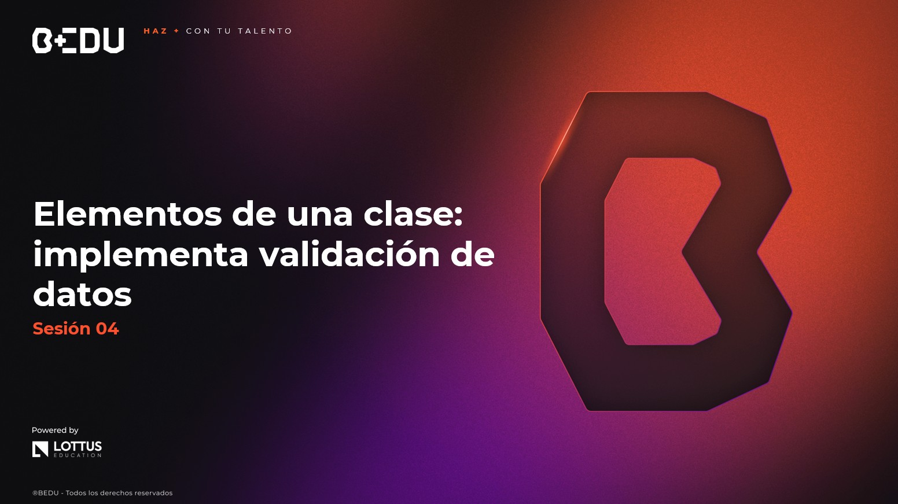

🏠 [**Inicio**](../Readme.md) ➡️ / 📖 `Sesión 04`

    

## 🎯 Objetivo

⚒️ Comprender los **elementos fundamentales de una clase en Java**, tales como los constructores, métodos especiales (`equals()`, `hashCode()`, `toString()`), el uso de `record` y `Objects.equals()`, así como los principios de **encapsulación** e **inmutabilidad**, para estructurar clases seguras, limpias y eficientes.

---

📘 Material del prework:

Antes de comenzar con los ejercicios de esta sesión, recordemos que en el material de prework hemos cubierto los fundamentos teóricos que aplicaremos hoy. A lo largo de esta sesión, pondremos en práctica estos conceptos mediante una serie de ejercicios y retos diseñados para reforzar y validar nuestro entendimiento. 
🔥¡Vamos a comenzar!🔥

---

## 📂 Temas de la sesión...

### 📖 Constructores e inicialización de objetos

Los **constructores** permiten crear e inicializar objetos de forma segura y controlada. Existen diferentes tipos:

- Constructor por defecto
- Constructor con parámetros
- Constructor de copia
- Sobrecarga de constructores
- Asignación de valores por defecto

🧠 Mejora la legibilidad, garantiza estados válidos y personaliza la creación de objetos.

##### 📜 **[Constructores e inicialización de objetos](Ejemplo-01/Readme.md)**
##### 🔥 **[Reto 01: Crear una clase Producto con sobrecarga de constructores](Reto-01/Readme.md)**
---

### 📖 Métodos `equals()`, `hashCode()` y `toString()`

Estos **métodos especiales** permiten comparar, identificar y representar objetos de forma efectiva:

- `equals()` compara el contenido de objetos
- `hashCode()` genera un valor hash único para estructuras como `HashSet`
- `toString()` muestra una representación legible del objeto

🧠 Ayudan en la depuración, comparación y organización del código.

##### 📜 **[Ejemplo 02: Métodos equals(), hashCode() y toString()](Ejemplo-02/Readme.md)**
##### 🔥 **[Reto 02: Implementar métodos especiales en una clase Empleado](Reto-02/Readme.md)**

---

### 📖 Uso de `record` y `Objects.equals()`

Java introduce nuevas herramientas para simplificar el manejo de datos:

- `record`: clases inmutables con menos código
- `Objects.equals()`: comparación segura de objetos (maneja `null`)

🧠 Permiten crear estructuras de datos limpias, modernas y sin errores de `NullPointerException`.

##### 📜 **[Ejemplo 03: Uso de record y Objects.equals()](Ejemplo-03/Readme.md)**
##### 🔥 **[Reto 03: Crear un record llamado Usuario con nombre y edad](Reto-03/Readme.md)**

---

### 📖 Principios de encapsulación e inmutabilidad

**Encapsular** atributos protege los datos internos de una clase. La **inmutabilidad** evita que los valores cambien una vez asignados.

- Uso de `private`, `getters` y `setters`
- Validación de datos
- Clases inmutables con atributos `final` y sin setters

🧠 Mejora la seguridad, mantenibilidad y evita errores.

##### 📜 **[Ejemplo 04: Principios de encapsulación e inmutabilidad](Ejemplo-04/Readme.md)**
##### 🔥 **[Reto 04: Crear una clase inmutable Cuenta con saldo y titular](Reto-04/Readme.md)**

---

⬅️ [**Anterior**](../Sesion-03/Readme.md) | [**Siguiente**](../Sesion-05/Readme.md)➡️
