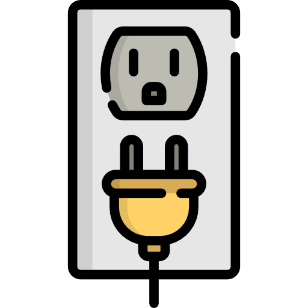

🏠 [**Inicio**](../../Readme.md) ➡️ / 📖 `Sesión 05`

<div align="center">
    
</div>

##### **PREWORK**
#### **🟧 Sesión 05**
#### **Herencia, composición y polimorfismo**


##### 🔶 **Introducción**  

¡Bienvenido/a a la Sesión 05! 

¡Estás cada vez más cerca de dominar Java! En esta sesión, vamos a explorar tres conceptos clave que te ayudarán a escribir código más limpio, reutilizable y flexible: **herencia, composición y polimorfismo**.  

Si alguna vez te has preguntado cómo evitar repetir código o cómo hacer que tus clases trabajen juntas de manera eficiente, aquí encontrarás las respuestas. Aprenderás cuándo es mejor heredar de una clase, cuándo es más útil componer objetos y cómo las interfaces y clases abstractas pueden hacer tu código más potente. Además, descubrirás cómo el polimorfismo te permite escribir código más genérico y reutilizable con `@Override`.

**🎯 Tu misión**: Explorar estos conceptos, hacer pruebas en tu entorno de desarrollo y llegar con dudas y preguntas a la sesión en vivo.

¡Vamos a por ello! 🚀💻

---

#### 🎯 Objetivo  

- Comprender y aplicar la herencia en Java para reutilizar código y modelar relaciones entre clases.
- Diferenciar entre herencia y composición, identificando cuándo utilizar cada enfoque de manera eficiente.
- Explorar el uso de interfaces y clases abstractas para extender funcionalidades y mejorar la estructura del código.
- Implementar el polimorfismo con `@Override`, permitiendo mayor flexibilidad y reutilización en el diseño de software.

---

#### 📋 Instrucciones  

Este Prework está diseñado para conocer el contenido que se practicará durante la sesión en vivo. **Por favor no lo omitas.**

Toma notas de lo que consideres relevante y guarda tus preguntas o dudas para resolverlas en la sesión.

Antes de arrancar, verifica que tu entorno de desarrollo esté listo. Es fundamental que tengas instalado IntelliJ IDEA Community Edition y el JDK (Java Development Kit) para trabajar sin interrupciones.

Si te surge alguna dificultad con la instalación o cualquier duda, no dudes en pedir ayuda a tu experto/a. ¡Estamos aquí para asegurarnos de que todo fluya sin problemas! 🚀

---

**Bienvenido/a**  

Bienvenid@ al quinto Prework del módulo. A continuación, te presentamos el tiempo estimado de lectura por tema, para que puedas revisar todos los recursos al máximo: 

| **📖 Temario**                                                    | **🕰️ Tiempo sugerido** |
|-------------------------------------------------------------------|----------------------|
| Tema 01. Introducción a la herencia en Java                       | 7 min                |
| Tema 02. Diferencia entre Herencia vs. Composición                | 7 min                |
| Tema 03. Uso de interfaces y clases abstractas                    | 3 min                |
| Tema 04. Aplicación del polimorfismo y uso de `@Override`         | 5 min                |

**¡Comencemos! 🏁**

---

#### 📚 Tema 01. Introducción a la herencia en Java
##### ⏳ 7 minutos de lectura

La herencia es uno de los conceptos más importantes de la programación orientada a objetos. Es la capacidad de una clase de heredar características (atributos y métodos) de otra, evitando la repetición de código y permitiendo la reutilización y extensión de funcionalidades.

**Concepto de herencia y su implementación**

Imagina que estás diseñando un videojuego y necesitas crear distintos tipos de personajes. Todos tienen cosas en común: un nombre, una barra de vida y la capacidad de moverse. En lugar de escribir estas características en cada tipo de personaje, puedes definir una *clase base (superclase)* que contenga estos elementos y luego crear *clases derivadas (subclases)* que hereden esas características y agreguen sus propias particularidades.

🤔 ¿Cómo funciona la herencia?  
- Una **superclase** es la clase de la que se heredan atributos y métodos.
- Una **subclase** es la clase que hereda y puede añadir o modificar funcionalidades.
- La herencia permite que las subclases reutilicen código sin necesidad de reescribirlo.

Ejemplo
💡 Piensa en una familia.

<table style="border-collapse: collapse;">
  <tr>
    <td style="border: 1px solid white; padding: 10px; vertical-align: top;">
      
    </td>
    <td style="border: 1px solid white; padding: 10px;">
      - Un padre puede tener ciertas habilidades y características (como el color de ojos, el tipo de cabello o ciertos talentos).<br>
      - Los hijos heredan algunas de estas características, pero también pueden tener sus propias habilidades.
    </td>
  </tr>
</table>

**Uso de `extends` y `super`**  
En Java, la herencia se implementa con la palabra clave `extends`, que indica que una clase hereda de otra.  
- `extends` se usa para establecer la relación de herencia entre una subclase y su superclase.
- `super` se usa dentro de la subclase para acceder a los atributos o métodos de la superclase.

**🤔 ¿Para qué sirve `super`?**  
✅ Llamar al constructor de la superclase.  
✅ Acceder a métodos o atributos de la superclase.  

Ejemplo

💡 Piensa en una caja de herramientas:
<table style="border-collapse: collapse;">
  <tr>
    <td style="border: 1px solid white; padding: 10px;">
      •	Una caja básica tiene un martillo y un destornillador.<br>
      •	Una caja más avanzada (subclase) puede heredar estas herramientas, pero además incluir un taladro y una sierra eléctrica.<br>
      •	Si necesitas usar el martillo de la caja básica dentro de la caja avanzada, simplemente accedes a él con super.
    </td>
    <td style="border: 1px solid white; padding: 10px; vertical-align: top;">
      
    </td>
  </tr>
</table>

💻 Ejemplo en código  

```java
// Superclase: Caja de herramientas básica
class CajaHerramientas {
    String martillo = "Martillo";
    String destornillador = "Destornillador";

    void mostrarHerramientas() {
        System.out.println("Herramientas básicas: " + martillo + ", " + destornillador);
    }
}

// Subclase: Caja de herramientas avanzada
class CajaHerramientasAvanzada extends CajaHerramientas {
    String taladro = "Taladro";
    String sierraElectrica = "Sierra Eléctrica";

    // Método para mostrar todas las herramientas
    void mostrarHerramientasAvanzadas() {
        super.mostrarHerramientas(); // Llama al método de la superclase
        System.out.println("Herramientas avanzadas: " + taladro + ", " + sierraElectrica);
    }
}

// Clase principal para ejecutar el código
public class Main {
    public static void main(String[] args) {
        CajaHerramientasAvanzada miCaja = new CajaHerramientasAvanzada();
        miCaja.mostrarHerramientasAvanzadas();
    }
}
```
Explicación rápida del código:  
1. **Superclase `CajaHerramientas`**: Contiene herramientas básicas (`martillo` y `destornillador`).
2.	**Subclase `CajaHerramientasAvanzada`**: Hereda de `CajaHerramientas` y añade nuevas herramientas (`taladro` y `sierraElectrica`).
3.	**Uso de `super.mostrarHerramientas();`**: Permite acceder al método de la superclase dentro de la subclase.
4.	**Ejecutamos en `Main`**: Creamos un objeto de `CajaHerramientasAvanzada` y mostramos todas las herramientas.

**Herencia simple vs. herencia múltiple**  
Existen dos tipos principales de herencia en la programación orientada a objetos:  

🟢 Herencia Simple  
- Una subclase solo hereda de una única superclase.
- Es fácil de entender y mantener.
- Java solo permite herencia simple (una clase solo puede tener una superclase).  

Ejemplo:  
📚 Un `LibroDigital` hereda de una clase `Libro`, obteniendo características como título y autor, pero agregando su propio atributo de tamaño en MB.  

🔴 Herencia Múltiple (No permitida en Java)
- 🚫 En algunos lenguajes, una subclase puede heredar de múltiples superclases.
- 🚫 Java no permite herencia múltiple con clases para evitar problemas de ambigüedad.
- ✔️ Sin embargo, se puede lograr algo similar usando interfaces (lo veremos más adelante 😉).

**🔎 Resumen**  
- Herencia: Permite que una clase reutilice atributos y métodos de otra.
- Superclase: Es la clase "madre" de la que heredan otras clases.
- Subclase: Es la clase que hereda atributos y métodos de la superclase.
- `extends`: Palabra clave utilizada para establecer herencia en Java.
- `super`: Permite acceder a los métodos y atributos de la superclase desde la subclase.
- Herencia simple: Una clase solo puede heredar de una única superclase.
- Herencia múltiple: No está permitida en Java, pero se pueden usar interfaces para lograr un comportamiento similar.  

📌 **¡Recuerda!** La herencia nos permite escribir código más organizado y reutilizable. Sin embargo, es importante saber cuándo usarla para no complicar innecesariamente el diseño de nuestras clases. 

---

#### 📚 Tema 02. Diferencia entre Herencia vs. Composición  
##### ⏳ 7 minutos de lectura  

A la hora de diseñar clases en Java, existen dos enfoques principales para reutilizar código y modelar relaciones entre objetos: *herencia* y *composición*. Aunque la herencia ha sido tradicionalmente el método más utilizado, la composición es considerada *un enfoque más moderno y flexible*.

🧐 ¿Cuál es la diferencia clave?  
- Herencia: Una clase hereda atributos y comportamientos de otra.
- Composición: Una clase contiene objetos de otras clases y delega responsabilidades.

💫 **Regla general:** *"Usa composición sobre herencia siempre que sea posible."*

**¿Qué es composición y cuándo usarla?**

La **composición** es una técnica en la que un objeto *contiene* una referencia a otro objeto en lugar de heredar de él.  

En lugar de decir:  
🔴 *“Un coche es un motor"* (herencia)

Decimos:  
🟢 *"Un coche tiene un motor"* (composición)  

**❓ Cuándo usar composición**  
- Cuando quieres mayor flexibilidad en el diseño del código.
- Cuando necesitas cambiar o extender funcionalidades sin afectar la estructura base.
- Cuando buscas evitar problemas de rigidez en la jerarquía de clases.
- Cuando un objeto tiene una relación *"tiene un"* (**has-a**) en lugar de *"es un"* (**is-a**).  

Ejemplo 

💡 Piensa en una empresa y sus empleados  
<table style="border-collapse: collapse;">
  <tr>
    <td style="border: 1px solid white; padding: 10px;">
      •	Una empresa tiene empleados (composición).<br>
      •	Un empleado no es una empresa, por lo que no tendría sentido usar herencia en este caso.<br>
    </td>
    <td style="border: 1px solid white; padding: 10px; vertical-align: top;">
      
    </td>
  </tr>
</table>

**Ventajas de la Composición sobre la Herencia**

| **Composición (recomendada)** | **Herencia (Útil, pero con limitaciones)** |
|-------------------------------|--------------------------------------------|
| ✅ **Más flexible**<br> Puedes cambiar componentes sin afectar toda la estructura. | ⚠️ **Rigidez**<br> Un cambio en la superclase afecta a todas las subclases. |
| 🔐 **Mejor encapsulación**<br> Oculta detalles internos y evita dependencias innecesarias. | 🔗 **Dependencia fuerte**<br> La subclase depende completamente de la superclase. |
| 🧬 **Evita problemas de herencia múltiple**<br> Puedes combinar varias clases sin ambigüedad. | 🚫 **Herencia múltiple no permitida en Java**<br> (excepto con interfaces). |
| 🧪 **Fácil de probar y modificar**<br> Permite intercambiar componentes con facilidad. | 📐 **Dificultad para cambiar comportamiento** sin afectar toda la jerarquía. |

📌 **En resumen**: La composición ofrece mayor flexibilidad y evita problemas estructurales.

**💻 Ejemplo con Composición (Mejor enfoque)**

Para ilustrar la diferencia, veamos un ejemplo con `Coche` y `Motor`.

➡️ Ejemplo con Herencia (🚫 No recomendado en este caso)

```java
// Herencia: Un coche hereda de Motor (NO recomendado)
class Motor {
    void encender() {
        System.out.println("Motor encendido");
    }
}

class Coche extends Motor {
    void conducir() {
        System.out.println("El coche está en movimiento");
    }
}

public class Main {
    public static void main(String[] args) {
        Coche miCoche = new Coche();
        miCoche.encender();
        miCoche.conducir();
    }
}
```
🔴 **Problema**: Un coche **no es** un motor, sino que **tiene** un motor. La herencia en este caso no representa bien la relación.

➡️ Ejemplo con Composición (✅Mejor enfoque)

```java
// Composición: Un coche tiene un motor (Recomendado)
class Motor {
    void encender() {
        System.out.println("Motor encendido");
    }
}

class Coche {
    private Motor motor; // Composición: El coche TIENE un motor

    public Coche() {
        this.motor = new Motor(); // Se crea un motor dentro del coche
    }

    void encenderCoche() {
        motor.encender(); // Delegamos la acción a la clase Motor
        System.out.println("El coche está listo para conducir");
    }
}

public class Main {
    public static void main(String[] args) {
        Coche miCoche = new Coche();
        miCoche.encenderCoche();
    }
}
```
🤔 ¿Por qué es mejor la composición aquí?  
- Más realista: Un coche tiene un motor en lugar de "ser" un motor.
- Modularidad: Si queremos cambiar la implementación del motor (ej. un motor eléctrico), podemos hacerlo sin modificar la clase Coche.
- Reutilización: Podemos usar la clase `Motor` en otros objetos sin necesidad de herencia.

**🔎 Resumen**  
- Herencia se usa cuando una clase realmente es una especialización de otra (Ejemplo: Un Perro es un Animal).
- Composición se usa cuando una clase contiene a otra como un componente (Ejemplo: Un Coche tiene un Motor).
- La composición es preferida en diseño moderno porque evita la rigidez de la herencia y promueve la reutilización de código de manera más flexible.

💫 **Consejo clave**: Usa herencia solo cuando sea necesario y prefiere composición cuando estés modelando relaciones entre objetos. 

---

#### 📚 Tema 03. Uso de interfaces y clases abstractas  
##### ⏳ 5 minutos de lectura 

En la programación orientada a objetos, las interfaces y clases abstractas son herramientas que se usan para definir comportamientos comunes y estructurar el código de manera eficiente. Ambos conceptos permiten establecer reglas para las clases, pero tienen diferencias importantes en su uso y aplicación.

**Definición de interfaces y clases abstractas**

🤔 ¿Qué es una clase abstracta?  
Una *clase abstracta* es una clase que *no se puede instanciar directamente*, ya que sirve como modelo para otras clases. Puede contener:
- Métodos concretos (con implementación).
- Métodos abstractos (sin implementación, definidos por las subclases).
- Atributos (variables de instancia).

Ejemplo 

<table style="border-collapse: collapse;">
  <tr>
    <td style="border: 1px solid white; padding: 10px;">
      Un vehículo es un concepto general, pero no puedes "crear" un vehículo en sí. Necesitas una subclase como Coche o Motocicleta para darle una forma específica.
    </td>
    <td style="border: 1px solid white; padding: 10px; vertical-align: top;">
      
    </td>
  </tr>
</table>

🤔 ¿Qué es una interfaz?  
Una *interfaz* define un *conjunto de métodos* que una clase debe implementar, sin proporcionar una implementación. Es como un contrato que las clases deben seguir.

Ejemplo 

<table style="border-collapse: collapse;">
  <tr>
    <td style="border: 1px solid white; padding: 10px; vertical-align: top;">
      
    </td>
    <td style="border: 1px solid white; padding: 10px;">
      Un enchufe eléctrico tiene un estándar de conexión. Cualquier dispositivo que quiera usarlo (computadora, televisor, cargador) debe implementar la forma correcta de conectarse. 
    </td>
  </tr>
</table>

**Diferencias clave y casos de uso**

| **Clases abstractas**                               | **Interfaces**                                            |
|-----------------------------------------------------|-----------------------------------------------------------|
| Pueden contener métodos con implementación y métodos abstractos. | Solo contienen métodos sin implementación (hasta Java 8, donde se añadieron métodos `default`).  |
| Permiten atributos con valores (pueden tener estado).   | No permiten atributos con valores (solo constantes).   |
| Se usa cuando las clases comparten atributos y métodos comunes.   | Se usa cuando diferentes clases deben seguir el mismo contrato, sin compartir atributos.   |
| Una clase solo puede heredar de una única clase abstracta.  | Una clase puede implementar múltiples interfaces (simulando herencia múltiple).  |

📌 ¿Cuándo usar cada una?  
- **Clase abstracta**: Cuando varias clases tienen atributos y métodos en común.
- **Interfaz**: Cuando varias clases deben compartir un comportamiento, pero no necesariamente atributos.

**🔎 Resumen**  
- Las clases abstractas son mejores cuando quieres compartir atributos y comportamiento entre clases relacionadas.
- Las interfaces son mejores cuando necesitas definir comportamientos comunes entre clases no relacionadas.
- En Java puedes usar ambas juntas: una clase puede heredar de una clase abstracta y también implementar interfaces.

**💫 Consejo clave**: Usa clases abstractas cuando necesites un esqueleto común para varias clases e interfaces cuando necesites definir comportamientos que varias clases deben seguir.

---

#### 📚 Tema 04. Aplicación del polimorfismo y uso de `@Override`
##### ⏳ 5 minutos de lectura

El *polimorfismo* es uno de los conceptos más poderosos y versátiles de la programación orientada a objetos. Su nombre viene del griego y significa *"muchas formas"*. En programación, hace referencia a la *capacidad de un objeto para comportarse de diferentes maneras según el contexto.*

**¿Qué es el polimorfismo y por qué es importante?**  

El polimorfismo permite que diferentes clases respondan de manera distinta al mismo mensaje o método.

Ejemplo 

💡 Piensa en la acción "hacer sonido".


<table style="border-collapse: collapse;">
  <tr>
    <td style="border: 1px solid white; padding: 10px;">
      Un perro ladra.<br>
      Un gato maúlla.<br>
      Un pájaro canta.
    </td>
    <td style="border: 1px solid white; padding: 10px; vertical-align: top;">
      
    </td>
  </tr>
</table>

Aunque todos responden al mismo mensaje ("haz sonido"), cada uno lo interpreta de forma distinta. ¡Eso es polimorfismo!

**Tipos de polimorfismo en Java**  

- Polimorfismo en tiempo de compilación (*sobrecarga de métodos — method overloading*)
- Polimorfismo en tiempo de ejecución (*sobreescritura de métodos — method overriding*) ← **Este es el enfoque principal de esta sesión.**

🤔 ¿Por qué es útil?  
- Permite escribir código más flexible y extensible.
- Hace posible trabajar con referencias genéricas que actúan según el tipo real del objeto.
- Facilita la reutilización y la organización lógica del código.

**Ejemplo de sobrescritura de métodos `@Override`**

La sobrescritura de métodos (`method overriding`) es un tipo de polimorfismo donde una subclase proporciona su propia versión de un método que ya existe en la superclase.

❓ ¿Cómo identificarla?  
- Mismo nombre del método.
- Misma firma (tipo de retorno y parámetros).
- Se redefine en la subclase.

Ejemplo 

```java
class Animal {
    void hacerSonido() {
        System.out.println("El animal hace un sonido.");
    }
}

class Perro extends Animal {
    @Override
    void hacerSonido() {
        System.out.println("El perro ladra.");
    }
}

class Gato extends Animal {
    @Override
    void hacerSonido() {
        System.out.println("El gato maúlla.");
    }
}
```

**Implementación con `@Override`**

La anotación `@Override` se usa para indicar que estás sobrescribiendo un método de la superclase. No es obligatoria, pero sí altamente recomendable porque:
- Ayuda a evitar errores de escritura.
- Hace el código más claro y legible.
- Es una forma de decirle al compilador y a otros programadores: *"esto está intencionalmente sobrescrito"*.

**Aplicación completa del polimorfismo**

```java
public class Main {
    public static void main(String[] args) {
        Animal miAnimal;

        miAnimal = new Perro();
        miAnimal.hacerSonido(); // El perro ladra.

        miAnimal = new Gato();
        miAnimal.hacerSonido(); // El gato maúlla.
    }
}
```
👀 Aunque `miAnimal` es del tipo `Animal`, el método `hacerSonido()` ejecuta la versión correspondiente al *tipo real del objeto* (`Perro` o `Gato`).  

**🔎 Resumen**   
- Polimorfismo: Un objeto se comporta de diferentes formas según el contexto.
- Sobreescritura: Una subclase redefine un método existente de la superclase.
- `@Override`: Anotación que indica una sobrescritura intencionada del método. Permite escribir código más limpio, flexible, mantenible y extensible.

**💫 Consejo clave**: Usa `@Override` siempre que sobrescribas un método. Así te aseguras de que la definición es correcta y clara.

---

#### 🧠 Actividad de reforzamiento  

**🎯 Caso práctico: Sistema de transporte urbano**

Estás desarrollando un sistema para gestionar distintos tipos de vehículos en una ciudad inteligente. Cada vehículo tiene comportamientos generales, pero también características y funciones específicas. El objetivo es aplicar conceptos de programación orientada a objetos para modelar este sistema de forma eficiente, reutilizable y escalable.

**📌 Requisitos del sistema:**  
1. **Todos los vehículos** deben tener una marca, un modelo y la capacidad de moverse.
2. Existen diferentes tipos de vehículos: **Autobús, Bicicleta,** y **Taxi.**
3. Cada tipo de vehículo **se mueve de forma distinta**, y ese comportamiento debe reflejarse en el sistema (→ polimorfismo).
4. Algunos vehículos, como el **Taxi**, tienen un **motor** (→ composición).
5. Todos los vehículos que **pueden transportar personas** deben implementar la interfaz Transportador.
6. Debe existir una clase abstracta `Vehiculo` que contenga la estructura base común.
7. Cada subclase debe sobrescribir el método `moverse()` con su comportamiento específico usando `@Override`.

**🛠️ Tareas a realizar:**
- Crear una **clase abstracta** `Vehiculo` con atributos `marca`, `modelo` y un método abstracto `moverse()`.
- Crear la **interfaz** `Transportador` con un método `transportarPasajeros()`.
- Implementar las subclases: `Autobus`, `Bicicleta` y `Taxi`.
- Implementar la **clase** `Motor` y usarla como c**omposición** dentro de `Taxi`.
- Usar `@Override` para definir el movimiento específico de cada vehículo.
- Simular los vehículos en una clase principal y mostrar cómo cada uno se comporta distinto usando **polimorfismo**.  

**✅ Lo que practicaras con este ejercicio:**
- Definir y extender clases abstractas.
- Usar interfaces para representar comportamientos comunes.
- Aplicar la composición con clases auxiliares como `Motor`.
- Sobrescribir métodos con `@Override`.
- Usar el polimorfismo para ejecutar comportamiento según el tipo real del objeto.

---

#### 📝 Cierre  

¡Felicidades por llegar hasta aquí! 🎉 En esta sesión has dado un gran paso en tu aprendizaje de Java, explorando conceptos fundamentales de la programación orientada a objetos:

- Herencia y su implementación con extends y super.
- Diferencias entre herencia y composición, entendiendo cuándo usar cada una.
- Interfaces y clases abstractas, y cómo pueden mejorar la flexibilidad de tu código.
- Polimorfismo y `@Override`, permitiendo que los objetos se comporten de manera dinámica.

**💡 Recuerda:** El objetivo de estos conceptos es ayudarte a escribir código más limpio, reutilizable y escalable. Ahora tienes las herramientas para estructurar mejor tus proyectos en Java.

**📌 ¿Qué sigue?**
💻 Ponte a prueba con el caso práctico que diseñamos en esta sesión.  
❓ Llega con dudas y preguntas a la sesión en vivo para aprovechar al máximo la interacción con el experto.  
🚀 Sigue practicando en tu entorno de desarrollo, experimentando con ejemplos propios.  

¡Nos vemos en la próxima sesión! Sigue adelante, estás construyendo una base sólida en Java. 💪🔥

---

⬅️ [**Anterior**](../../Sesion-04/Prework/Readme.md) | [**Siguiente**](../../Sesion-06/Prework/Readme.md)➡️