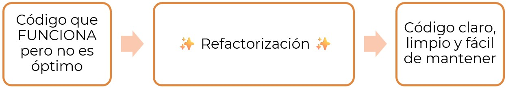
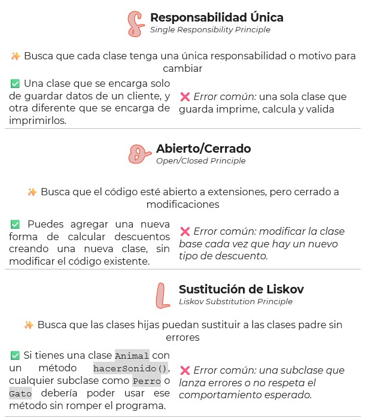
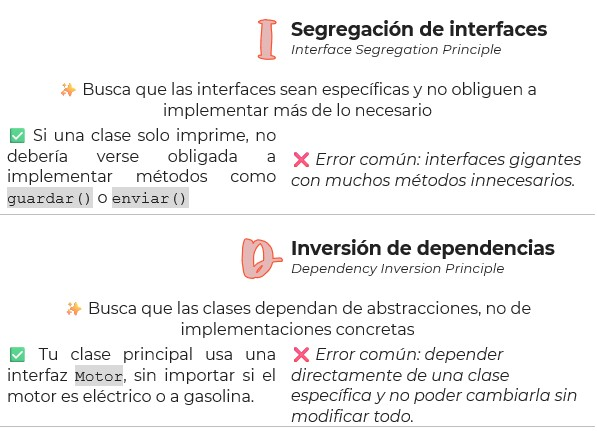
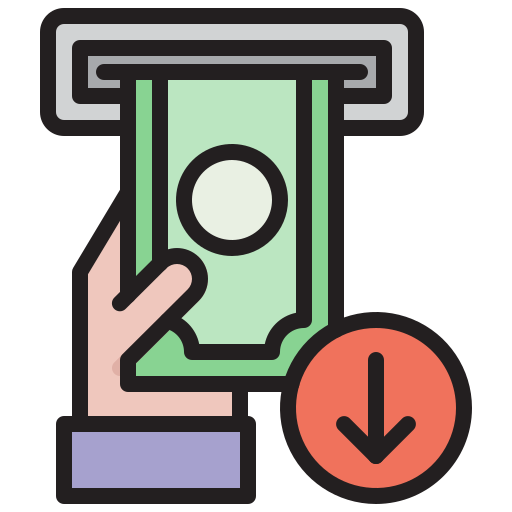
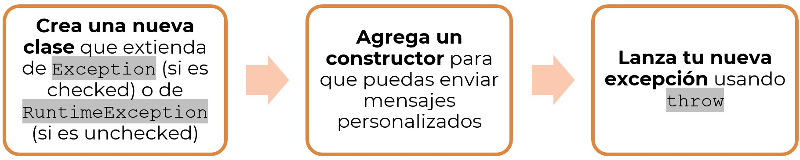

🏠 [**Inicio**](../../Readme.md) ➡️ / 📖 `Prework sesión 08`

<div align="center">
    
</div>

##### **PREWORK**
#### **🟧 Sesión 08**
#### **Buenas prácticas y manejo de errores en Java**

##### 🔶 **Introducción** 

¡Hola! 👋

¡Llegaste a la última sesión del curso! 🎉 En esta etapa, vas a descubrir herramientas y prácticas que te ayudarán a escribir código más limpio, robusto y fácil de mantener. Esta sesión está pensada para que des ese salto que marca la diferencia entre simplemente hacer que el código funcione… y hacerlo bien 💡.

Vas a conocer los principios SOLID, aprender a detectar y corregir malos olores en el código (sí, los famosos code smells), y dominarás técnicas clave para manejar errores de manera profesional.

Este prework es tu primer acercamiento. Léelo con calma, explora los ejemplos y llega a la sesión en vivo con una base clara. ¡Estás a punto de cerrar con broche de oro! 🚀

¡Vamos a por ello!

---

#### 🎯 Objetivo  

- Comprender qué es la refactorización y cómo identificar code smells en un proyecto Java.
- Aplicar los principios SOLID para diseñar código limpio, escalable y mantenible.
- Implementar técnicas para optimizar el rendimiento y la estructura del código.
- Identificar y manejar adecuadamente excepciones en Java usando try-catch-finally, throw y throws.

---

#### 📋 Instrucciones  

Este Prework está diseñado para conocer el contenido que se practicará durante la sesión en vivo. Por favor no lo omitas. Toma notas de lo que consideres relevante y guarda tus preguntas o dudas para resolverlas en la sesión.

---

#### Bienvenido/a

Bienvenid@ al octavo Prework del módulo. A continuación, te presentamos el tiempo estimado de lectura por tema, para que puedas revisar todos los recursos al máximo: 

| **📖 Temario**                                                                         | **🕰️ Tiempo sugerido** |
|-----------------------------------------------------------------------------------------|------------------------|
| Tema 01. Refactorización y Code Smells                                                  | 5 min                  |
| Tema 02. Principios SOLID en Java                                                       | 5 min                  |
| Tema 03. Técnicas para mejorar el rendimiento del código                                | 5 min                  |
| Tema 04. Tipos de excepciones (`checked`, `unchecked`) y manejo con `try-catch-finally` | 5 min                  |
| Tema 05. Uso de `throw` y `throws` para excepciones personalizadas                      | 5 min                  |

**¡Comencemos! 🏁**

---
 
#### 📚 Tema 01. Refactorización y Code Smells 
##### ⏳ 5 minutos de lectura

Llegaste a un punto clave en tu camino como desarrollador/a: aprender a escribir código que no solo funcione, sino que también sea *limpio, ordenado y fácil de entender*. 🧠✨

Este conocimiento te ayudará a pulir tus habilidades, evitar errores comunes y, sobre todo, a trabajar con mayor confianza en proyectos reales.
¡Prepárate para detectar, limpiar y mejorar tu código como todo un profesional! 💻🔍

**¿Qué es la refactorización y por qué es importante?**  

*Refactorizar* significa *reorganizar y mejorar tu código sin cambiar lo que hace*. Es como ordenar tu cuarto: no compras muebles nuevos ni cambias la función de cada objeto, solo limpias, acomodas mejor y haces que todo sea más funcional. 🧹💻  

🤔 ¿Por qué deberías refactorizar tu código? Aquí tienes algunas buenas razones:  

| 🔍 Situación                                 | ✅ Beneficio de refactorizar                          |
|-----------------------------------------------|-------------------------------------------------------|
| Tu código funciona, pero es difícil de leer   | Lo haces más claro y comprensible                     |
| Hay mucho código repetido                     | Eliminas redundancias y usas funciones reutilizables  |
| Te cuesta encontrar errores                   | Un código ordenado facilita la detección de fallos    |
| Quieres trabajar en equipo                    | El código limpio es más fácil de compartir y mantener |

💡**Recuerda:** Refactorizar no es arreglar errores, es mejorar la estructura del código para que sea más limpio, entendible y fácil de mantener.  

**Identificación de código poco eficiente (*Code Smells*)**

Un *code smell* o “olor a código” no significa que el programa no funcione, sino que *hay algo en su estructura que huele raro* 😅, y que puede traer problemas a futuro.

🔷 Tipos comunes de Code Smells
| **Code Smell**             | **¿Qué significa?**                                | **¿Qué podrías hacer?**                            |
|----------------------------|----------------------------------------------------|----------------------------------------------------|
| Código duplicado           | Mismo bloque de código aparece varias veces        | Reutiliza funciones                                |
| Funciones muy largas       | Una sola función hace demasiadas cosas             | Divide en funciones más pequeñas                   |
| Nombres confusos           | Variables o funciones con nombres poco claros      | Usa nombres descriptivos y coherentes              |
| Muchas responsabilidades   | Una clase o función hace demasiadas cosas a la vez | Aplica el principio de responsabilidad única (SRP) |
| Código comentado           | Muchas líneas comentadas que ya no se usan         | Elimínalo si no es necesario                       |

🎯 Tu objetivo como desarrollador/a es detectar estos olores y corregirlos antes de que el código se vuelva difícil de entender o mantener.  

**Miniguía para empezar a refactorizar tu código**

Aquí tienes algunas acciones simples que puedes aplicar desde ya para mejorar la calidad de tu código. No necesitas ser experto, solo observar con atención y aplicar con intención:

<div align="center">
  
</div>

**💡 Consejo:** Refactoriza como si otra persona tuviera que entender tu código mañana… aunque esa persona seas tú mismo, pregúntate:

> *“¿Yo entendería esto si lo leyera dentro de 6 meses?”*  

**🔎 Resumen**  

<div align="center">
  
</div>

**🧠 Para reflexionar…**
- ¿Has escrito alguna vez una función que tú mismo tuviste que leer varias veces para entender?
- ¿Crees que podrías mejorar algo que hiciste en proyectos anteriores?
- ¿Te animas a empezar a identificar y eliminar tus propios code smells?

---

#### 📚 Tema 02. Principios SOLID en Java
##### ⏳ 5 minutos de lectura

Cuando tu código comienza a crecer, puede volverse difícil de mantener, entender y modificar. Aquí es donde entran en juego los principios SOLID, un conjunto de buenas prácticas que te ayudarán a escribir código organizado, escalable y fácil de modificar sin romperlo.

El nombre SOLID es un acrónimo de cinco principios fundamentales de diseño orientado a objetos. No te preocupes, no necesitas memorizarlos de golpe. Aquí los descubrirás paso a paso con ejemplos simples y explicaciones claras. 🙌

<div align="center">
  
</div>

<div align="center">
  
</div>

**💬 Para reflexionar**
- ¿Has escrito alguna clase que haga “de todo”?
- ¿Crees que separar responsabilidades te ayudaría a depurar más rápido?
- ¿Qué principio crees que podrías empezar a aplicar desde ya?

---

#### 📚 Tema 03. Técnicas para mejorar el rendimiento del código
##### ⏳ 5 minutos de lectura

No basta con que el código funcione. Cuando tu aplicación crece o se enfrenta a tareas más pesadas, pequeños detalles pueden marcar una gran diferencia en el rendimiento.  

En este apartado aprenderás cómo optimizar tu código desde tres ángulos clave: estructuras de datos, simplicidad en el diseño y uso eficiente de la memoria. No se trata de programar como un genio, sino de *tomar decisiones inteligentes desde el principio.* 🧠⚡  

**Optimización de estructuras de datos en Java**

Elegir la *estructura adecuada* para cada situación es uno de los pasos más simples (y potentes) para mejorar el rendimiento de tu programa.  

| **Estructura**     | **Úsala cuando…**                                                          |
|--------------------|----------------------------------------------------------------------------|
| `ArrayList`        | Necesitas acceso rápido a elementos por índice                             |
| `LinkedList`       | Haces muchas inserciones o eliminaciones en medio de la lista              |
| `HashMap`          | Quieres buscar valores rápidamente a partir de una clave                   |
| `HashSet`          | Quieres asegurarte de no tener elementos duplicados                        |
| `Queue` / `Stack`  | Necesitas una estructura de tipo “primero en entrar” o “último en salir”   |

**💡 Recuerda:** Si eliges mal tu estructura de datos, podrías hacer que tu programa tarde segundos… o minutos en completarse.

**Reducción de complejidad en métodos y clases**

El código más rápido no siempre es el más inteligente, sino el *más simple*.  
Aquí tienes algunas recomendaciones:  

- ✂️ Divide funciones grandes en métodos más pequeños y específicos.
- 🔁 Evita bucles innecesarios: revisa si puedes salir antes de un for o reducir la cantidad de iteraciones.
- ❌ Elimina lógica duplicada que esté dispersa en distintas partes del código.
- 🔍 Prefiere la claridad sobre la “inteligencia extrema”. Un código entendible se optimiza más fácil.

**💡 Recuerda:** Cuanto más complejo es un método, más difícil es de mantener y más lento puede ejecutarse.  

**Uso eficiente de memoria y gestión de recursos**

Java hace mucho trabajo por ti con su recolector de basura (*garbage collector*), pero tú también puedes ayudarlo. Aquí te comparto cómo:  

| **Buenas prácticas**                            | **¿Qué logras con esto?**                                      |
|-------------------------------------------------|----------------------------------------------------------------|
| Cierra archivos, conexiones y recursos          | Evitas fugas de memoria y errores inesperados                  |
| Evita crear objetos innecesarios                | Reduces el consumo de memoria                                  |
| Reutiliza objetos cuando sea posible            | Ahorras recursos y procesamiento                               |
| Usa estructuras adecuadas al tamaño             | No guardes 1000 elementos si solo necesitas 10                 |

⚠️ **Dato importante:** Si no gestionas bien los recursos, puedes ralentizar tu aplicación o incluso hacer que se caiga.  

**🧠 Para reflexionar…**
- ¿Has usado alguna vez una lista cuando en realidad necesitabas un mapa?
- ¿Tus métodos podrían ser más cortos o claros?
- ¿Estás reutilizando recursos o creando objetos que no necesitas?

---

#### 📚 Tema 04. Tipos de excepciones (`checked`, `unchecked`) y manejo con `try-catch-finally`
##### ⏳ 5 minutos de lectura

En la vida real, las cosas no siempre salen como esperas. En la programación, pasa lo mismo: los errores existen, y saber cómo manejarlos es parte de ser un buen desarrollador/a.

Java tiene un sistema robusto para detectar y manejar errores: las *excepciones*. 

**¿Qué son las excepciones y por qué son importantes en Java?**

Una *excepción* es un evento inesperado que ocurre durante la ejecución del programa y que *interrumpe el flujo normal del código*.

Ejemplos 

| **Situación**                       | **Excepción**                     |
|-------------------------------------|-----------------------------------|
| Dividir un número entre 0           | `ArithmeticException`             |
| Acceder a una posición inexistente  | `ArrayIndexOutOfBoundsException`  |
| Abrir un archivo que no existe      | `FileNotFoundException`           |
| Ingresar datos incorrectos          | `InputMismatchException`          |

💡 Las excepciones ayudan a detectar errores, evitar que la aplicación se detenga bruscamente y dar una respuesta adecuada al usuario.

**Diferencias entre excepciones `checked` y `unchecked`**

Java divide las excepciones en dos grandes grupos:

| **Tipo de excepción** | **¿Se detecta en tiempo de compilación?** | **¿Se debe manejar obligatoriamente?** | **Ejemplos**                                   |
|-----------------------|-------------------------------------------|----------------------------------------|------------------------------------------------|
| Checked               | ✅ Sí                                    | ✅ Sí                                  | `IOException`, `SQLException`                  |
| Unchecked             | ❌ No                                    | ❌ No (aunque es recomendable)         | `NullPointerException`, `ArithmeticException`  |

🔎 Resumen sencillo:  
- `Checked`: Java te obliga a manejarla o declararla (usando `try-catch` o `throws`).
- `Unchecked`: Java no te obliga, pero si no las controlas, pueden romper tu programa.

**Manejo de errores con `try-catch-finally`**

💻 Estructura básica

```java
try {
    // Código que puede lanzar una excepción
} catch (TipoDeExcepcion e) {
    // Código para manejar la excepción
} finally {
    // Código que siempre se ejecuta (opcional)
}
```
👀¿Para qué sirve cada parte?

- `try` ➡️ Intenta ejecutar el código que podría fallar
- `catch` ➡️ Captura y maneja el error si ocurre
- `finally` ➡️ Siempre se ejecuta (haya error o no), ideal para liberar recursos

📌 Aquí algunos consejos útiles

<div align="center">
  
</div>

**💬 Para reflexionar**
- ¿Qué haría tu programa si el usuario ingresa un dato incorrecto?
- ¿Has visto alguna vez un error de “índice fuera de rango”?
- ¿Crees que usar excepciones te daría más control en tus programas?

---

#### 📚 Tema 05. Uso de `throw` y `throws` para excepciones personalizadas
##### ⏳ 5 minutos de lectura

Hasta ahora has aprendido a manejar errores que ya existen en Java. Pero, ¿qué pasa si quieres lanzar tus propios errores personalizados?
¡Aquí es donde entran `throw` y `throws`! 🧨

**¿Qué es `throw` y cómo lanzar excepciones manualmente?**

`throw` se utiliza para *lanzar una excepción específica* de forma manual cuando detectas una situación inesperada en tu código.

> 🗣️ "Si ocurre esta condición, lanzo un error para detener el flujo y avisar que algo anda mal."

Ejemplo

<table style="border-collapse: collapse;">
  <tr>
    <td style="border: 1px solid white; padding: 10px;">
       Si en un cajero alguien intenta retirar una cantidad mayor al saldo disponible, puedes lanzar una excepción personalizada que diga: “Fondos insuficientes”.
    </td>
    <td style="border: 1px solid white; padding: 10px; vertical-align: top;">
      
    </td>
  </tr>
</table>

| **Elemento** | **Descripción**                                      |
|--------------|------------------------------------------------------|
| `throw`      | Se usa dentro del código para lanzar una excepción   |
| Sintaxis     | `throw new NombreDeExcepcion("mensaje");`            |

**Uso de `throws` en la declaración de métodos**

Mientras que `throw` *lanza* una excepción, `throws` *declara* que un método *puede lanzar una excepción*. Esto le avisa al resto del programa que quien use ese método debe estar preparado para manejar el posible error.

📌 Lo usas cuando sabes que puede ocurrir un error, pero no lo vas a manejar tú directamente.

| **Elemento** | **Descripción**                                  |
|--------------|--------------------------------------------------|
| `throws`     | Se coloca en la firma del método                 |
| Sintaxis     | `public void miMetodo() throws IOException {}`   |


✅ Reglas claras = código más seguro y predecible.  

**Creación y manejo de excepciones personalizadas**  

Una excepción personalizada te permite crear tu propio tipo de error, con un mensaje claro y una lógica específica. Esto es muy útil cuando necesitas controlar reglas de negocio o situaciones particulares.  

**Pasos para crear una excepción personalizada**  


<div align="center">
  
</div>

💻 Ejemplo en código

```java
// Paso 1: Crear la clase de excepción personalizada
public class EdadNoValidaException extends Exception {
    
    // Constructor con mensaje personalizado
    public EdadNoValidaException(String mensaje) {
        super(mensaje);  // Llama al constructor de la clase Exception
    }
}

// Clase principal con validación
public class Registro {

    // Paso 2: Declarar que el método puede lanzar una excepción
    public static void validarEdad(int edad) throws EdadNoValidaException {
        if (edad < 18) {
            // Paso 3: Lanzar la excepción personalizada
            throw new EdadNoValidaException("Debes tener al menos 18 años para registrarte.");
        }
        System.out.println("Edad válida. Registro exitoso.");
    }

    // Método main para probar la lógica
    public static void main(String[] args) {
        try {
            validarEdad(16);  // Cambia este valor para probar
        } catch (EdadNoValidaException e) {
            // Manejo de la excepción
            System.out.println("¡Error! " + e.getMessage());
        }
    }
}
```
🤔 ¿Qué pasa aquí?
- Se crea una excepción llamada `EdadNoValidaException`.
- El método `validarEdad` declara que puede lanzar esa excepción con throws.
- Si la edad no es válida, lanza la excepción con `throw`.
- En el método `main`, usamos `try-catch` para capturar y mostrar el error.

**💫Ventajas** de crear tus propias excepciones:
- Puedes describir exactamente qué ocurrió.
- El código se vuelve más claro y controlado.
- Facilitas la depuración y el mantenimiento.

💬 Para reflexionar
- ¿En qué parte de tu programa sería útil lanzar una excepción personalizada?
- ¿Prefieres manejar los errores tú o avisar a quien use tu método?
- ¿Qué mensaje pondrías en tu primera excepción?

---

🧠 **Actividad de reforzamiento**

**Instrucciones:**
Imagina que estás desarrollando una aplicación para inscribir personas a un curso en línea. El curso tiene los siguientes requisitos:
1. La persona debe tener al menos *16 años*.
2. El nombre del estudiante *no puede estar vacío*.
3. El número de intentos de registro *no puede ser mayor a 3*. 

Tu reto será:
- Crear dos excepciones personalizadas
- Validar los datos usando throw y throws
- Manejar los errores con try-catch

**🧠 Preguntas de reflexión**
- ¿Qué ventajas tiene lanzar excepciones personalizadas en lugar de solo imprimir mensajes de error?
- ¿Qué pasa si no usas throws en la firma del método?
- ¿Dónde podría aplicar esto en un proyecto real?

---

#### 📝 Cierre

¡Felicidades! 🎉

Has llegado al final de la última sesión del curso, y eso no es cualquier cosa. En esta etapa diste un gran paso: pasaste de escribir código que simplemente funciona, a escribir código que es **limpio, mantenible, eficiente y preparado para lo inesperado**.

Aprendiste a:
- Detectar y corregir malos hábitos de programación (code smells)
- Aplicar principios SOLID para estructurar mejor tu código
- Optimizar rendimiento y uso de memoria
- Manejar errores con confianza usando try-catch-finally
- Crear y lanzar tus propias excepciones con throw y throws

**💡 Recuerda**
El camino del desarrollo no termina aquí. Ahora tienes herramientas que te ayudarán a escribir mejor código, trabajar en equipo con mayor fluidez, y construir aplicaciones más profesionales.
El verdadero poder está en **la práctica constante** y en tu curiosidad por seguir aprendiendo.

#### ✨ No necesitas hacerlo perfecto. Solo necesitas comenzar. ✨

¡Nos vemos en la sesión en vivo! Gracias por llegar hasta aquí, y sigue programando con propósito y pasión. 💻🔥

---

⬅️ [**Anterior**](../../Sesion-07/Prework/Readme.md) | [**Siguiente**](../../Sesion-09/Prework/Readme.md)➡️