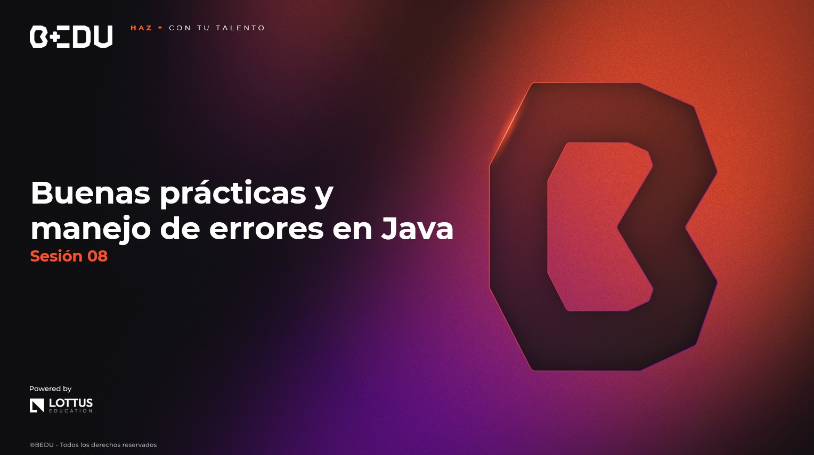

🏠 [**Inicio**](../Readme.md) ➡️ / 📖 `Sesión 08`

    

## 🎯 Objetivo

⚒️ Aprender a **escribir código limpio, robusto y mantenible** en Java aplicando principios SOLID, detectando y eliminando code smells, optimizando rendimiento y utilizando adecuadamente el **manejo de excepciones** (`try-catch`, `throw`, `throws`) y excepciones personalizadas.

---

📘 Material del prework:

Antes de comenzar con los ejercicios de esta sesión, recordemos que en el material de prework hemos cubierto los fundamentos teóricos que aplicaremos hoy. A lo largo de esta sesión, pondremos en práctica estos conceptos mediante una serie de ejercicios y retos diseñados para reforzar y validar nuestro entendimiento. 
🔥¡Vamos a comenzar!🔥

---

## 📂 Temas de la sesión...

### 📖  Refactorización y code smells

Refactorizar es mejorar la estructura del código sin cambiar su funcionalidad. Los **code smells** son señales de que algo no está bien.

- Código duplicado, funciones largas, nombres confusos
- Eliminación de código muerto
- Buenas prácticas para simplificar y reutilizar

##### 📜 **[Refactorización y code smells](Ejemplo-01/Readme.md)**
##### 🔥 **[Reto 01:   ](Reto-01/Readme.md)**
---

### 📖 Principios SOLID en Java

Los principios **SOLID** son la base para escribir código orientado a objetos que sea escalable y fácil de mantener.

- SRP, OCP, LSP, ISP, DIP
- Aplicación con ejemplos cotidianos

##### 📜 **[Ejemplo 02: Principios SOLID en Java](Ejemplo-02/Readme.md)**
##### 🔥 **[Reto 02:   ](Reto-02/Readme.md)**

---

### 📖 Técnicas para mejorar el rendimiento

Escribir código eficiente mejora la experiencia del usuario y reduce el consumo de recursos.

- Uso adecuado de estructuras (`ArrayList`, `HashMap`, `HashSet`)
- Reducción de complejidad en métodos
- Gestión de memoria y recursos

##### 📜 **[Ejemplo 03: Técnicas para mejorar el rendimiento](Ejemplo-03/Readme.md)**
##### 🔥 **[Reto 03:   ](Reto-03/Readme.md)**

---

### 📖 Manejo de excepciones con `try-catch-finally`

Las **excepciones** permiten manejar errores de forma segura y controlada.

- Tipos: `checked` y `unchecked`
- Estructura `try-catch-finally`
- Evitar que el programa se caiga inesperadamente

##### 📜 **[Ejemplo 04: Manejo de excepciones con try-catch-finally](Ejemplo-04/Readme.md)**
##### 🔥 **[Reto 04:   ](Reto-04/Readme.md)**

---

### 📖 Uso de `throw`, `throws` y excepciones personalizadas

Cuando las excepciones predefinidas no son suficientes, puedes crear las tuyas propias.

- `throw`: lanzar una excepción
- `throws`: declarar que un método puede lanzar una excepción
- Excepciones personalizadas

##### 📜 **[Ejemplo 05: Uso de throw, throws y excepciones personalizadas](Ejemplo-05/Readme.md)**
##### 🔥 **[Reto 05:   ](Reto-05/Readme.md)**

---

⬅️ [**Anterior**](../Sesion-07/Readme.md) | [**Siguiente**](../Sesion-09/Readme.md)➡️
